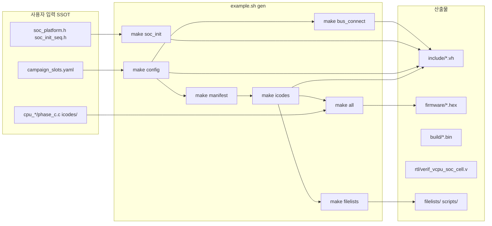

# `example.sh` 산출물 가이드 (`example_outputs.md`)

`./example.sh` / `./example.py`가 **생성(`gen`)**·**시뮬(`sim`)**·**정리(`clean`)** 할 때 패키지 안에 나타나는 폴더·파일의 의미와, **어디를 사용자가 수정해야 하는지**를 정리한 문서입니다.

**패키지 루트:** `verif_cpu_verilog/` (이하 *루트*)

---

## 1. 언제 무엇이 생기나

| 명령 | 주요 산출 |
|------|-----------|
| `./example.sh gen` | 펌웨어 빌드, `include/*.vh`, `rtl/verif_vcpu_soc_cell.v`, `filelists/`, `scripts/` |
| `./example.sh sim` | `sim_build/*.vvp`, `sim_build/*.vcd`, `logs/full_campaign/*.vcd` |
| `./example.sh gen --axi 58 --ahb 1 --apb 1` | 위 + `BUS_LAYOUT` 반영 connect/cell, `.bus_layout_stamp` |
| `make filelists` (gen 마지막 단계) | `filelists/`·`scripts/` 재생성 |
| `./example.sh clean` | 시뮬/빌드 산출물만 삭제 (§8 참고) |

### 생성 파이프라인 (gen)

---

## 2. 최상위 폴더 요약

| 경로 | 생성 시점 | 역할 |
|------|-----------|------|
| `firmware/campaign/build/` | `gen` | VCPU·icode 바이너리, disassembly |
| `firmware/campaign/cpus.mk` | `gen` (`config`) | 활성 CPU별 make 규칙 (Makefile include) |
| `firmware/campaign/cpu_rules.mk` | `gen` | CPU 빌드 규칙 보조 |
| `firmware/campaign/.bus_layout_stamp` | `gen` (`BUS_LAYOUT` 있을 때) | layout 고정 스탬프 (clean 시 삭제) |
| `firmware/full_campaign_*.hex` | `gen` (`merge`) | iverilog `readmemh`용 통합 이미지 |
| `include/` | `gen` | Verilog `include` — **대부분 자동 생성** |
| `rtl/verif_vcpu_soc_cell.v` | `gen` (`soc_cell` / icodes) | VCPU+AMBA bridge 셀 RTL |
| `filelists/` | `gen` (`make filelists`) | iverilog·VCS·Xcelium·Verdi용 compile list |
| `scripts/` | `gen` | 시뮬레이터·Verdi 실행 예시 스크립트 |
| `sim_build/` | `sim` | `.vvp` 실행파일, `.vcd` 파형 |
| `logs/full_campaign/` | `sim` | SCPU별 계층 VCD |

---

## 3. `firmware/campaign/build/` — 펌웨어 바이너리

`make all` / `merge_campaign.py`의 입력·중간 산출입니다. **직접 편집하지 않습니다.**

| 파일/패턴 | 의미 |
|-----------|------|
| `full_campaign_vcpu.bin` | VCPU 펌웨어 영역(raw) |
| `icode_pool.bin` | icode 바이너리 풀 (TB·VCPU가 참조) |
| `icodes/*.bin` | 개별 icode ELF→bin |
| `cpu_sfr.bin`, `cpu_sram.bin`, `cpu_uart.bin` … | `cpus.mk`에 정의된 활성 슬롯별 VCPU 이미지 |
| `*.dis` | objdump 디스어셈블리 (디버그용) |

**다시 만들기:** `cd firmware/campaign && make all` 또는 `./example.sh gen`

### `icodes/` — manifest에 묶인 icode만 빌드

| 경로 | 의미 |
|------|------|
| `icodes/sfr/`, `sram/`, `uart/` | **수동** `check_*` icode C (Phase C 검증) |
| `icodes/probe/` | **자동 생성** probe icode (manifest에 없으면 비움) |
| `icodes/icodes.mk` | `gen_icodes_c.py`가 쓰는 **컴파일 목록** (기본 6개 = 3 CPU × 2 targets) |

icode 개수는 **yaml이 아니라 생성된 `campaign_manifest.h`** 기준입니다 (`NUM_SCPU` 적용 후).

| 예 | NUM_SCPU | active | icodes | probe/ |
|----|----------|--------|--------|--------|
| `./example.sh gen` | 60 (yaml) | 3 | 6 | 0 (hand만) |
| `./example.sh gen --axi 1` | 1 | 1 (SFR만) | 2 | 0 |

`--axi N`이 yaml active보다 작으면 **WARN**으로 잘리는 슬롯을 알려 줍니다.  
catalog-50 회귀: `ICODE_CATALOG=50 ./example.sh gen`

---

## 4. `firmware/*.hex` — 시뮬용 통합 HEX

| 파일 | 의미 |
|------|------|
| `full_campaign_unified.hex` | unified pool + VCPU + icode가 합쳐진 **공식 campaign** 이미지 |
| `full_campaign_vcpu.hex` | VCPU 영역만 분리한 hex (보조) |

TB의 `` `CAMPAIGN_LOAD_FIRMWARE `` 매크로가 `full_campaign_unified.hex`를 로드합니다.

---

## 5. `include/` — Verilog 헤더

### 5.1 자동 생성 (헤더에 `Auto-generated` — **수동 편집 금지**)

| 파일 | 생성 스크립트 | 내용 |
|------|---------------|------|
| `campaign_params.vh` | `gen_campaign_config.py` | `CAMPAIGN_NUM_SCPU`, manifest 상수 |
| `campaign_scale.vh` | `gen_campaign_config.py` | 슬롯 수·pool stride |
| `campaign_manifest.vh` | `gen_campaign_manifest.py` | 슬롯 메타 (C 헤더 미러) |
| `campaign_soc_platform.vh` | `gen_soc_init.py` | SoC 플랫폼 매크로 |
| `soc_init_seq.vh` | `gen_soc_init.py` | 17-step SoC init 시퀀스 |
| `icode_map.vh`, `icode_bind.vh` | `build_icode_pool.py` | icode 주소·바인딩 |
| `tb_full_campaign_gen.vh` | `gen_tb_campaign.py` | Phase A/B/C TB 태스크·체크리스트 |
| `tb_soc_manifest_*.vh` | `gen_tb_campaign.py` | manifest integration TB |
| `tb_soc_manifest_scale_*.vh` | `gen_tb_campaign.py` | 60-slot scale TB |
| `chip_top_*.vh`, `verif_chip_soc_bus_*.vh` | `gen_tb_campaign.py` | chip-top 예시 TB |
| `verif_manifest*_soc_bus_*.vh` | `gen_tb_campaign.py` | manifest bus read/write bind |
| `verif_soc_bus_connect.vh` | `gen_soc_bus_connect.py` | `CONNECT_SLV*` SoC 포트 매크로 |

### 5.2 수동 유지 (코어 RTL·플랫폼 정의)

| 파일 | 용도 |
|------|------|
| `verif_cpu_defs.vh` | VCPU 파라미터·opcode 상수 |
| `verif_cpu_decode.vh`, `verif_cpu_execute.vh` | 디코드/실행 include |
| `verif_platform_defs.vh` | orchestrator·agent 상수 |
| `verif_bus_defs.vh` | AMBA 신호 폭·타입 |
| `verif_amba_connect_macros.vh` | 외부 SoC 연결 매크로 템플릿 |
| `verif_manifest_soc_bus_macros.vh` | manifest bus bind 보조 |
| `verif_cpu_wave.vh`, `verif_cpu_log.vh` … | 트레이스·로그 옵션 |

---

## 6. `rtl/verif_vcpu_soc_cell.v`

`gen_soc_cell_rtl.py`가 `campaign_slots.yaml`·`BUS_LAYOUT`·`amba_bus_registry.py`를 읽어 생성합니다.

- **역할:** VCPU 코어 + 선택 AMBA master bridge 1셀
- **인스턴스:** manifest / chip-top / scale TB에서 `g_slv0` … 형태로 다수 배치
- **수정:** YAML·registry·`gen_soc_cell_rtl.py` 쪽에서 변경 후 `./example.sh gen`

---

## 7. `filelists/` — 컴파일 리스트

`tools/gen_filelist.py`가 `make filelists`로 생성합니다. **전부 재생성 대상** (수동 편집 불필요).

### 7.1 `filelists/*.f` — iverilog·단일 flist

| 파일 | 용도 |
|------|------|
| `incdirs.f` | `+incdir+include`, `+incdir+firmware/campaign/include` |
| `rtl_core.f` / `rtl_soc.f` / `rtl_bus.f` … | RTL 조각별 목록 |
| `full_campaign.f` | 공식 campaign TB 전체 |
| `soc_manifest.f` / `soc_manifest_scale.f` | integration TB |
| `chip_top_example.f` | yaml hierarchy smoke |
| `integration_dut.f` | 고객 칩용 (TB 제외) |
| `verdi_*.f` | Verdi 단일 import용 (incdir+RTL+TB 합본) |

### 7.2 `filelists/eda/<view>/` — VCS·Xcelium 3분할

각 **view** (`full_campaign`, `soc_manifest`, `soc_manifest_scale`, `chip_top_example`, `integration_dut`)마다:

| 파일 | 의미 |
|------|------|
| `vcpu.list` | `verif_cpu_*` 코어 RTL (view 공통) |
| `rtl.list` | SoC·orchestrator·AMBA bridge·soc_cell (view별) |
| `tb_top.list` | TB top `.v` 한 줄 |
| `incdirs.list` | include 경로 |
| `defines.list` | `+define+` (integration TB용) |
| `manifest.list` | 위 list를 순서대로 `-F` 묶음 |
| `top.txt` | top 모듈명 (`tb_full_campaign` 등) |
| `vcd.txt` | sim 후 기대 VCD 경로 (있는 view만) |

---

## 8. `scripts/` — 시뮬·GUI 실행 예시

`make filelists` 시 함께 생성됩니다. **예시 래퍼**이며, 회사 EDA flow에 맞게 복사·수정해 사용합니다.

| 경로 | 도구 | 예 |
|------|------|-----|
| `scripts/iverilog/run.sh` | Icarus Verilog | `./scripts/iverilog/run.sh full_campaign` |
| `scripts/verilator/run.sh` | Verilator | `./scripts/verilator/run.sh soc_manifest` |
| `scripts/vcs/compile.sh`, `run.sh` | Synopsys VCS | `./scripts/vcs/run.sh full_campaign` |
| `scripts/xcelium/run.sh` | Cadence xrun | `./scripts/xcelium/run.sh soc_manifest_scale` |
| `scripts/verdi/*.sh` | Verdi | `./scripts/verdi/full_campaign.sh` |
| `scripts/lib/eda_lists.sh` | 공통 | `.list` 파싱 헬퍼 |

view별 shortcut: `scripts/<sim>/<view>.sh` → `run.sh <view>` 호출.

---

## 9. `sim_build/` · `logs/` — 시뮬 산출 (`sim` 이후)

| 경로 | 의미 |
|------|------|
| `sim_build/tb_full_campaign.vvp` | iverilog 컴파일 결과 (공식 gate) |
| `sim_build/tb_full_campaign.vcd` | 메인 파형 (`verify_vcd.py` 입력) |
| `sim_build/tb_soc_manifest*.vvp` | integration TB 빌드 (별도 make 타깃) |
| `sim_build/iverilog_<view>/` | `scripts/iverilog/run.sh` 산출 |
| `sim_build/vcs_<view>/`, `xcelium_<view>/`, `verilator_<view>/` | EDA 스크립트 빌드 디렉터리 |
| `logs/full_campaign/SCPU1.vcd` … | SCPU별 계층 VCD |

---

## 10. 사용자 수정 가이드 (핵심 표)

**원칙:** YAML·C·수동 `.h`·RTL/TB **소스**를 고치고 → `./example.sh gen` (필요 시 `sim`)으로 산출물을 갱신합니다.  
`include/*Auto-generated*`, `filelists/`, `scripts/`는 **직접 수정하지 않습니다.**

| 수정 목적 | 수정할 위치 | 편집 | gen 후 갱신되는 대표 산출 |
|-----------|-------------|------|---------------------------|
| 활성 SCPU 개수·슬롯 정의 (SFR/SRAM/UART…) | `firmware/campaign/campaign_slots.yaml` | ✅ **SSOT** | `campaign_params.vh`, `cpus.mk`, `campaign_manifest.*`, scale/manifest VH |
| 슬롯별 버스 종류·개수 (60셀 layout) | `./example.sh gen --axi N --ahb M …` 또는 `BUS_LAYOUT` env | ✅ | `campaign_params.vh`, `verif_soc_bus_connect.vh`, `verif_vcpu_soc_cell.v`, scale VH |
| SoC init 17-step 시퀀스 | `firmware/campaign/include/soc_init_seq.h` | ✅ | `include/soc_init_seq.vh` |
| SoC 플랫폼 상수·에이전트 | `firmware/campaign/include/soc_platform.h` | ✅ | `include/campaign_soc_platform.vh` |
| 레지스터 주소·이름 | `firmware/campaign/include/soc_regs.h` | ✅ | 펌웨어·icode·TB 체크에 반영 (연쇄 rebuild) |
| VCPU Phase A/B 공통 | `firmware/campaign/common/phase_*.c` | ✅ | `build/*.bin` → `*.hex` |
| 슬롯별 Phase C 펌웨어 | `firmware/campaign/cpu_sfr/`, `cpu_sram/`, `cpu_uart/` … | ✅ | 해당 `cpu_*.bin` |
| icode 검증 루틴 | `firmware/campaign/icodes/{sfr,sram,uart}/*.c` (hand) | ✅ | manifest `targets[].icode`만 컴파일 |
| icode catalog-50 regression | `ICODE_CATALOG=50 ./example.sh gen` | ✅ (선택) | `icodes/probe/*.c` 44개 + verify-50 |
| icode 카탈로그·프로브 C 자동 생성 | `firmware/campaign/gen_icodes_c.py` | ✅ (고급) | `icodes/probe/*.c` |
| Phase TB 태스크·체크 문자열 | `firmware/campaign/gen_tb_campaign.py` | ✅ (고급) | `tb_full_campaign_gen.vh` 등 |
| AMBA 버스 타입 레지스트리 | `firmware/campaign/amba_bus_registry.py` | ✅ (고급) | connect, soc_cell, filelists |
| 외부 SoC hierarchy (chip-top) | `firmware/campaign/soc_hierarchy_example.yaml` | ✅ | `chip_top_*`, `bus_connect_yaml` 경로 VH |
| VCPU·SoC RTL 동작 | `rtl/*.v` (soc_cell 제외) | ✅ | 시뮬만 재실행 가능 (`make full_campaign`) |
| TB 껍데기·타임스케일 | `tb/*.v` | ✅ | 해당 타깃 재컴파일 |
| 공식 campaign 게이트 | `Makefile`, `example.sh` | ✅ (유지보수) | 전체 flow |
| VCD 검증 규칙 | `tools/verify_vcd.py` | ✅ | `sim` 후 post-check |
| EDA compile list | `tools/gen_filelist.py` | ✅ (고급) | `filelists/`, `scripts/` |
| 생성된 `.vh` / connect / TB gen | `include/tb_*_gen.vh`, `verif_soc_bus_connect.vh` … | ❌ | `./example.sh gen` |
| 펌웨어 bin / hex | `firmware/campaign/build/`, `firmware/*.hex` | ❌ | `make all` / `gen` |
| filelists / scripts | `filelists/`, `scripts/` | ❌ | `make filelists` / `gen` |
| 시뮬 산출 | `sim_build/`, `logs/` | ❌ | `./example.sh sim` 또는 `clean` |

### 편집 후 권장 명령

| 변경 범위 | 명령 |
|-----------|------|
| YAML·펌웨어·icode | `./example.sh gen` |
| RTL/TB만 | `make full_campaign` (또는 해당 make 타깃) |
| layout 초기화 후 재설정 | `./example.sh clean` → `./example.sh gen …` |
| EDA list만 | `make filelists` |

---

## 11. `clean`과의 관계

`./example.sh clean` → `make clean-artifacts` → `tools/clean_generated.py`

### 지우는 것

| 범주 | 경로 |
|------|------|
| FW 빌드 | `firmware/campaign/build/` |
| FW merge hex | `firmware/full_campaign_*.hex` |
| FW 생성 헤더 | `firmware/campaign/include/campaign_manifest.h`, `campaign_layout.h`, `icode_map.h`, `icode_map.json` |
| FW make 산출 | `cpus.mk`, `cpu_rules.mk`, `.bus_layout_stamp` |
| Verilog 생성 | `include/*` (Auto-generated `.vh`), `rtl/verif_vcpu_soc_cell.v` |
| 시뮬 | `sim_build/`, `logs/` |
| EDA 예시 | `filelists/`, `scripts/` (`gen` 시 재생성) |

### 남기는 것 (손으로 편집하는 SSOT)

| 경로 | 이유 |
|------|------|
| `firmware/campaign/campaign_slots.yaml` | 슬롯 SSOT |
| `firmware/campaign/include/soc_regs.h`, `soc_platform.h`, `soc_init_seq.h`, `verif_insns.h` | 플랫폼·레지스터 소스 |
| `firmware/harness_*.hex`, `firmware/rv32i_test.hex` | 고정 harness TB용 |
| `firmware/campaign/icodes/`, `cpu_*/`, `common/` | 펌웨어·icode 소스 |
| `rtl/*.v` (soc_cell 제외), `tb/*.v` | RTL/TB 소스 |

`clean` 후에는 `./example.sh gen`으로 FW·VH·filelists·scripts를 다시 만듭니다.  
`git pull`과 완전 동일하진 않지만(로컬 소스 수정은 유지), **gen 산출물은 대부분 비운 상태**입니다.

---

## 12. 빠른 참조 — gen 단계 ↔ 산출

| `example.sh gen` 단계 | Makefile 타깃 | 대표 산출 |
|------------------------|---------------|-----------|
| config | `make config` | `cpus.mk`, `campaign_params.vh`, `campaign_scale.vh`, `campaign_manifest.h` |
| soc_init | `make soc_init` | `soc_init_seq.vh`, `campaign_soc_platform.vh` |
| manifest | `make manifest` | `campaign_manifest.vh` |
| icodes | `make icodes` | `icode_pool.bin`, `icode_map.vh`, `tb_full_campaign_gen.vh`, manifest/chip VH |
| bus_connect | `make bus_connect` | `verif_soc_bus_connect.vh` (`BUS_LAYOUT` 시) |
| all | `make all` | `build/*.bin`, `firmware/full_campaign_unified.hex` |
| filelists | `make filelists` | `filelists/`, `scripts/` |

---

## 13. 관련 문서

| 문서 | 내용 |
|------|------|
| [README.md](README.md) | 빠른 시작·make 타깃·게이트 요약 |
| [howto_integrate.md](howto_integrate.md) | 실칩 AXI 통합·manifest·CONNECT_SLV |
| [vcpu_skill.md](vcpu_skill.md) | Agent/LLM용 manifest·icode 계약 |
| [scripts/README.txt](scripts/README.txt) | 시뮬 run 스크립트 (gen 시 생성) |
| [filelists/eda/README.txt](filelists/eda/README.txt) | VCS/Xcelium list (gen 시 생성) |