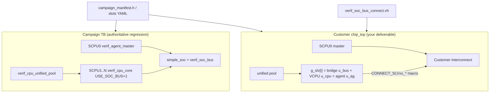
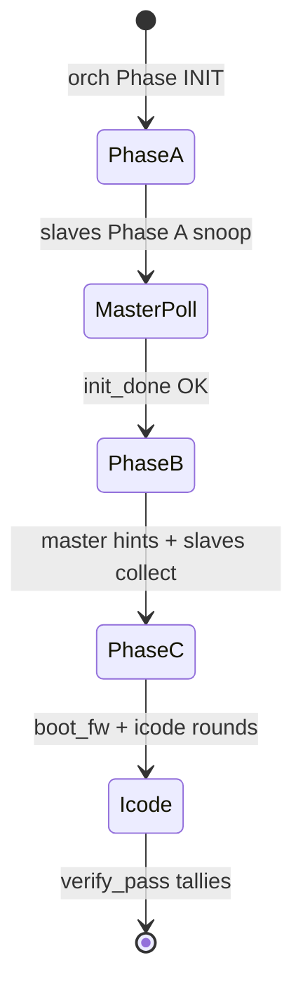

# VCPU Skill — Agentic LLM Integration Guide

**Audience:** An autonomous LLM agent integrating **VerifCPU VCPUs** into a **customer SoC top** — not merely running `./example.sh`.

**Package root:** Directory containing `example.sh`, `firmware/campaign/`, `rtl/`.

**Human companion docs:** [howto_integrate.md](howto_integrate.md) (signal-level), [howto_integrate2yourSoC.md](howto_integrate2yourSoC.md) (procedure), [README.md](README.md) (build gates).

**Slot / bus / targets SSOT (human + LLM):** [firmware/campaign/campaign_slots_GUIDE.md](firmware/campaign/campaign_slots_GUIDE.md) — edit **only** `campaign_slots.yaml`.

**soc-verify-agent integration vault (LLM):** `soc-verify-agent/templates/obsidian/agent/vcpu-soc-integration/00-INTEGRATION-HUB.md` — workflow, gate links; slots SSOT: `14-CAMPAIGN-SLOTS-SSOT.md`.

---

## 0. Agent mission statement

Your job is to turn the customer's interconnect documentation (address map, `Sxx_AXI` / `Mxx_AHB` port list, clock domains) into a **working verification block** that:

1. Runs phased RV32 firmware on N slave VCPUs + 1 master agent (SCPU0).
2. Drives **real AMBA masters** into the chip interconnect (not `simple_soc`).
3. Lets `verif_agent_slave` snoop bus traffic and execute icode checks.
4. Passes `./example.sh` (firmware/agents) **and** customer-top simulation.

`./example.sh` alone proves the **campaign regression TB**. It does **not** prove chip wiring.

---

## 1. Mental model — two worlds



| Environment | `bus_type` in manifest | VCPU bus path | SoC model |
|-------------|------------------------|---------------|-----------|
| Campaign TB | `task` (default for actives) | `verif_soc_bus` → `simple_soc` tasks | `simple_soc` |
| Customer top | `apb3`, `ahb_lite`, `axi4lite`, … | AMBA bridge `u_bus` → chip ports | Customer IC + IPs |

Campaign **25/25 PASS** + `0xDEADDEAD` validates firmware, phases, agents, icode pool.  
Chip integration validates **manifest `bus_port` ↔ RTL prefix** and **bridge protocol**.

---

## 2. Central contract — manifest row per slave

Every slave slot `cpu_id` (1..N) has one manifest row. **Authoring SSOT:** `firmware/campaign/campaign_slots.yaml` (`active[]`). Generated manifest/VH/RTL wiring derive from it — do not duplicate rows in intake or `soc_hierarchy_*.yaml`.

```text
SlaveRecord {
  name       : string          // "UART", "DMA_CH3"
  cpu_id     : int 1..N       // orchestrator id, pool region, logs
  tap_port   : int            // agent snoop array index (≠ bus port number)
  enabled    : 0 | 1          // 0 = reserved NOOP, 1 = runs Phase A/B/C
  bus_type   : canonical key  // apb3 | ahb_lite | axi4lite | task | none | …
  bus_port   : string         // RTL prefix: "S37_AXI" → S37_AXI_arvalid, …
  pool_word  : auto           // unified.hex offset for this CPU's FW
  targets[]  : active only    // { sym, expect, icode } for Phase B/C
}
```

**Index convention (critical):**

| Concept | Indexing |
|---------|----------|
| `cpu_id` | 1-based (SCPU1 = first slave) |
| `g_slv[]` generate array | **0-based:** `g_slv[cpu_id - 1]` |
| Connect VH macro | `CONNECT_SLV{cpu_id:02d}_{TAG}` → `g_slv[cpu_id-1].u_bus` |
| `tap_port` | Agent array index; campaign example uses 0,1,2 for cpu 1,2,3 |

**Three IDs an agent must not conflate:**

- `cpu_id` — firmware/orchestrator identity
- `tap_port` — where `verif_agent_slave` watches traffic
- `bus_port` — customer interconnect RTL prefix (`S37_AXI`)

---

## 3. Information to collect (ask the user first)

Per **active or wired** slave:

| Field | Question | Example |
|-------|----------|---------|
| `cpu_id` | Which SCPU index? | `37` |
| `tap_port` | Which snoop channel? | `37` (confirm; may differ from cpu_id) |
| `bus_type` | Protocol at this master port | `axi4lite` |
| `bus_port` | Exact RTL prefix on interconnect | `S37_AXI` |
| `addr_base` / targets | Registers Phase B/C must access | `0x4A00_0000` |
| `role` | Firmware profile | `sfr`, `sram`, `uart`, `noop` |

Chip-wide:

- `CAMPAIGN_NUM_SCPU` = total slave count (active + reserved)
- Which ids are **active** vs **reserved** (reserved still get manifest rows + pool stride)
- Clock/reset per bus domain
- `INIT_DONE` register address for master poll (`soc_platform.h` / `make soc_init`)

---

## 4. Decision tree — `bus_type`

```
Customer master port at this VCPU is...
├─ Single-beat register access
│  ├─ APB fabric  → apb3 (default --apb) | apb2/4/5 if sideband needed
│  └─ AXI fabric  → axi4lite (default --axi)
├─ AHB peripheral → ahb_lite (default --ahb) | ahb5_lite | ahb (burst)
├─ DMA / memory burst → axi3full | axi4full | axi5full (--axi3/4/5)
├─ Campaign regression only → task (simple_soc; no chip wire)
├─ Placeholder slot → none
└─ NoC NIU / CHI / ACE → manifest + CONNECT_NIU placeholder; vendor spec required
```

**Shorthand CLI defaults:** `--apb`→`apb3`, `--ahb`→`ahb_lite`, `--axi`→`axi4lite`.  
**SSOT:** `firmware/campaign/amba_bus_registry.py` (`rtl_module`, `port_fmt`, `rtl_status`).

---

## 5. Configuration — two input paths

### Path A — Bulk bus mix (ordered CLI)

Flag **order** = ascending `cpu_id` starting at SCPU1.

```bash
# SCPU1–62 axi4lite, 63 ahb_lite, 64 apb3
./example.sh gen --axi 62 --ahb 1 --apb 1
```

- `NUM_SCPU` = sum of counts; do not pass conflicting positional N.
- Default `bus_port` from registry: `S{id:02d}_AXI`, `M{id:02d}_AHB`, `S{id:02d}_APB`.
- Env: `BUS_LAYOUT=axi4lite:10,apb3:2 make -C firmware/campaign config`.

### Path B — Per-slave overrides (YAML / slots)

For non-contiguous layouts or custom port names, edit:

- `firmware/campaign/campaign_slots.yaml` — active slots + optional `bus_type`/`bus_port`
- `firmware/campaign/soc_hierarchy_example.yaml` — chip-specific copy for connect-only preview

```yaml
- name: DMA_CH3
  cpu_id: 37
  tap_port: 37
  bus_type: axi          # resolved to axi4lite via alias
  bus_port: S37_AXI      # must match chip RTL exactly
```

Then:

```bash
./example.sh gen                              # manifest from slots + BUS_LAYOUT
make -C firmware/campaign bus_connect         # manifest → connect VH
make -C firmware/campaign bus_connect_yaml    # YAML-only preview (example file)
```

---

## 6. Phase orchestration (what the chip TB must run)



| Phase | Orchestrator | Master SCPU0 | Slave VCPU + Agent |
|-------|--------------|--------------|-------------------|
| A INIT | `phase_release(PHASE_INIT)` | — | SoC init seq; agent snoop |
| A→B gate | — | Poll `INIT_DONE_ADDR` via bus read | — |
| B COLLECT | `phase_release(PHASE_COLLECT)` | Inject manifest read hints | Agents collect bus txns |
| C / icode | `boot_fw`, `orch_reset` pulses | — | RV32 icode exec + agent verify |

Reference implementation: `tb/tb_full_campaign.v` + generated `include/tb_full_campaign_gen.vh`.  
For chip top, replicate **orchestrator + pool + master + generate slaves**; replace `simple_soc` with interconnect + `CONNECT_SLV*` macros.

---

## 7. Agent workflow (SoC integration)

### Step 1 — Scale and bus layout

```bash
./example.sh gen --axi 62 --ahb 1 --apb 1   # or Path B YAML edits first
```

Writes: `include/campaign_params.vh`, `campaign_manifest.h`, `campaign_scale.vh`, `cpus.mk`.

### Step 2 — Declare active CPUs

Edit `campaign_slots.yaml` `active:` — only SFR/SRAM/UART-style slots that run phases.  
Reserved slots: not in YAML → `enabled: 0`, shared NOOP firmware, **may still have** `bus_type` from BUS_LAYOUT.

Re-run `./example.sh gen`.

### Step 3 — Generate connect VH

```bash
make -C firmware/campaign bus_connect
# → include/verif_soc_bus_connect.vh
```

Each wired slot gets e.g.:

```verilog
`define CONNECT_SLV37_AXI4LITE `CONNECT_AXI_LITE(S37_AXI, g_slv[36].u_bus)
```

Macros definitions: `include/verif_amba_connect_macros.vh`.

### Step 4 — Firmware + icode

```bash
make -C firmware/campaign all
python3 tools/probe_icodes.py    # icode bus_addr vs manifest
```

### Step 5 — Write customer `chip_top` (core LLM task)

**Required hierarchy per slot** `i = cpu_id - 1`:

```text
g_slv[i]/
  u_bus   ← AMBA bridge (name contract for connect VH)
  u_cpu   ← verif_cpu_core
  u_ag    ← verif_agent_slave
```

**Bridge module** — lookup `amba_bus_registry.py` → `rtl_module`:

| bus_type | Module |
|----------|--------|
| apb3 | `verif_apb_master` |
| apb2/4/5 | `verif_apb2_master` / `verif_apb4_master` / `verif_apb5_master` |
| ahb_lite | `verif_ahb_lite_master` |
| ahb5_lite | `verif_ahb5_lite_master` |
| ahb | `verif_ahb_master` |
| axi4lite | `verif_axi_lite_master` |
| axi3/4/5 full | `verif_axi_full_master #(.AXI_PROT(3\|4\|5))` |

**Skeleton** (agent adapts bus-type-specific ports and clocks):

```verilog
module verif_vcpu_soc_cell #(
  parameter int CPU_ID = 1,
  parameter int TAP_PORT = 0
) (
  input aclk, aresetn,
  // orchestrator broadcast
  input [1:0]  orch_phase,
  input [31:0] orch_boot_fw,
  input        orch_reset
);
  // --- 1) Bridge: MUST be named u_bus (connect VH path) ---
  verif_axi_lite_master u_bus (
    .ACLK(aclk), .ARESETn(aresetn),
    // AR/AW/W/R/B ↔ customer interconnect via CONNECT_SLVxx macro in parent
    .snoop_valid (sn_v), .snoop_wr (sn_wr),
    .snoop_addr  (sn_addr), .snoop_data (sn_data)
  );

  // --- 2) VCPU: USE_SOC_BUS=0; firmware issues bus_read/write ---
  verif_cpu_core #(
    .CPU_ID(CPU_ID), .USE_SHARED_BUS(0), .USE_SHARED_POOL(0), .USE_SOC_BUS(0)
  ) u_cpu ( ... );

  // --- 3) Agent: snoop from bridge, not from cpu core ---
  verif_agent_slave #(.CPU_ID(CPU_ID), .TAP_PORT(TAP_PORT)) u_ag (
    .phase(orch_phase), .boot_fw_offset(orch_boot_fw), .reset_pulse(orch_reset),
    .txn_valid(sn_v), .txn_is_write(sn_wr),
    .txn_addr(sn_addr), .txn_data(sn_data),
    ...
  );

  initial u_cpu.cpu_set_hierarchy(CPU_ID);

  // --- 4) Bus adapter (agent implements) ---
  // verif_cpu_core currently contains internal verif_cpu_bus u_bus.
  // Chip integration requires forwarding cpu bus transactions to the
  // sibling AMBA bridge u_bus above. Implement a thin adapter module
  // or hierarchical task bind so firmware bus_read/write hits the chip.
endmodule
```

**Parent top:**

```verilog
`include "verif_soc_bus_connect.vh"

generate
  for (gi = 0; gi < `CAMPAIGN_NUM_SCPU; gi = gi + 1) begin : g_slv
    verif_vcpu_soc_cell #(.CPU_ID(gi+1), .TAP_PORT(manifest_tap[gi])) u_cell ( ... );
  end
endgenerate

`APPLY_ALL_SOC_BUS_CONNECTS   // or per-slot `CONNECT_SLV37_AXI4LITE;
```

**Shared blocks** (same as campaign): `verif_orchestrator`, `verif_cpu_unified_pool`, `verif_agent_master` (SCPU0, `cpu_id=0`, no bridge).

### Step 6 — Verify

| Gate | Command | Proves |
|------|---------|--------|
| Firmware/agents | `./example.sh` / `make full_campaign` | Phase flow, icode, 25-check |
| Bridge RTL | `make soc-bus-all` | 11 AMBA master variants |
| Bridge VCD | `make soc-bus-vcd` | Protocol + read data |
| Manifest integration | `make soc-manifest` | 3 active slaves + real bridges (23-check) |
| Scale integration | `make soc-manifest-scale` | N-slot BUS_LAYOUT flat fabric (26-check) |
| Chip top example | `make chip-top-example` | yaml hierarchy + bus R/W (16-check) |
| Chip top | Customer TB + GTKWave | Real interconnect |

---

## 8. Signal groups — per slave vs shared

| Group | Per slave? | Wiring |
|-------|------------|--------|
| AMBA master pins | Yes | `CONNECT_SLVxx_*` macro (generated) |
| Snoop `valid,wr,addr,data` | Yes | Bridge → `verif_agent_slave` |
| Orchestrator `phase,boot_fw,reset` | Shared | Broadcast |
| Pool region | Per cpu_id | `cpu_attach_pool_region(base, size)` |
| `hierarchy_id` | Per cpu | `initial cpu_set_hierarchy(id)` — internal only |

CPU × 100: **manifest + generate** carries AMBA wiring; agent writes **one generate loop**, not 100 manual bus copies.

---

## 9. Mapping customer docs → config

Customer table:

```text
Port        Type        IP
S01_APB     APB3        uart0
M02_AHB     AHB-Lite    sram_ctrl
S37_AXI     AXI4-Lite   dma_cfg
```

Agent actions:

1. Set `CAMPAIGN_NUM_SCPU` ≥ max `cpu_id`.
2. For each row: ensure manifest `bus_type` + `bus_port` match **exact** RTL prefix.
3. Map IPs to `role` + `targets[]` in `campaign_slots.yaml` for actives.
4. `./example.sh gen` → `make bus_connect`.
5. Instantiate bridge from registry; apply matching `CONNECT_SLVxx_*`.

---

## 10. Anti-patterns

| Wrong | Right |
|-------|-------|
| Put `simple_soc` in chip top | Customer interconnect + bridge macros |
| `tap_port` = AXI port index without confirmation | Ask user; record in manifest |
| Hand-edit `verif_soc_bus_connect.vh` | `make bus_connect` |
| `--axi` for burst DMA | `--axi4` / `axi4full` |
| `./example.sh` PASS = chip done | Also sim chip top with CONNECT macros |
| Skip reserved slots in manifest | They occupy pool stride; use NOOP |
| Rename `u_bus` in `g_slv[i]` | Connect VH hardcodes `g_slv[i].u_bus` |

---

## 11. Example prompts → agent plan

### "64 slots, 3 active, rest on AXI to NoC"

1. Ask: active ids, AXI lite vs full, `bus_port` naming, NoC clock domain.
2. `./example.sh gen --axi 64` (or mixed layout).
3. Edit `campaign_slots.yaml` for 3 actives.
4. `make bus_connect`; generate `verif_vcpu_soc_cell` per slot; `APPLY_ALL_SOC_BUS_CONNECTS`.
5. `make full_campaign` then chip TB.

### "Slot 1 UART/APB, slot 2 SRAM/AHB, 3–100 reserved AXI"

```bash
./example.sh gen --apb 1 --ahb 1 --axi 98
```

Override `bus_port` in YAML if not `S01_APB` / `M02_AHB`.

### "Prove bridges before touching chip top"

```bash
make soc-bus-vcd
```

Expect PASS from `tools/verify_amba_bus_vcd.py`.

---

## 12. Files — edit vs generate

| Agent may edit | Never hand-edit |
|----------------|-----------------|
| `campaign_slots.yaml` | `include/campaign_manifest.vh` |
| `soc_hierarchy_*.yaml` (chip copy) | `include/campaign_scale.vh` |
| Customer `chip_top.v`, `verif_vcpu_soc_cell.v` | `include/verif_soc_bus_connect.vh` |
| `include/campaign_params.vh` or `NUM_SCPU=` | `include/tb_full_campaign_gen.vh` |
| `include/soc_platform.h` (init_done addr) | `firmware/campaign/cpus.mk` |

After YAML / `NUM_SCPU` / `BUS_LAYOUT` change: `./example.sh gen` (or `make config-scale`) then `make bus_connect`.  
Layout persists in `firmware/campaign/.bus_layout_stamp` across `make icodes`. Clear with `make clean-artifacts`.

| Connect VH source | When |
|-------------------|------|
| `make bus_connect` | manifest / scale (`soc-manifest`, `soc-manifest-scale`) |
| `make bus_connect_yaml` | `soc_hierarchy_example.yaml` (`chip-top-example`) |

---

## 13. Success checklist (report to user)

- [ ] `CAMPAIGN_NUM_SCPU` matches customer slot count
- [ ] Manifest rows: every wired slave has `bus_type` + `bus_port`
- [ ] `make bus_connect` emitted `CONNECT_SLVxx_*` for those slots
- [ ] `g_slv[cpu_id-1].u_bus` = registry `rtl_module`
- [ ] Agent snoop wired from bridge; `tap_port` matches manifest
- [ ] Bus adapter: VCPU `bus_read`/`bus_write` reach chip (not internal `verif_cpu_bus` only)
- [ ] `./example.sh` → 25/25 PASS, `0xDEADDEAD`
- [ ] (optional) `make soc-manifest-scale` → 26/26 after `BUS_LAYOUT`
- [ ] (optional) `make chip-top-example` → 16/16
- [ ] Optional: `make soc-bus-vcd` PASS
- [ ] Optional: chip top sim — first active CPU reaches expected `bus_addr`

---

## 14. Key paths

```text
rtl/verif_cpu_core.v              # VCPU execution
rtl/verif_*_master.v              # AMBA bridges (bus_read/bus_write tasks)
rtl/verif_agent.v                 # master + slave agents
rtl/verif_orchestrator.v
include/verif_amba_connect_macros.vh
include/verif_soc_bus_connect.vh  # generated
firmware/campaign/amba_bus_registry.py
firmware/campaign/gen_soc_bus_connect.py
tools/probe_icodes.py
tools/verify_amba_bus_vcd.py
```