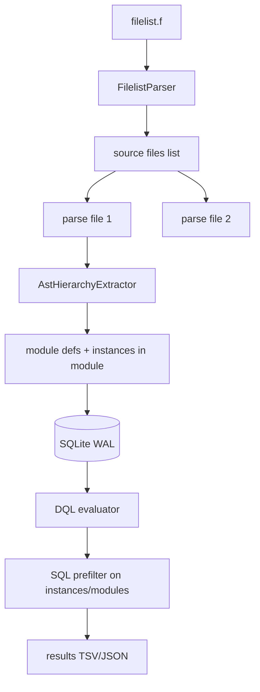

# Architecture

## Data model (index-time)

```text
files          — path, mtime
modules        — module_name, definition_file_id, ports[], params[]
instances      — full_path, inst_name, module_id, depth, parent_path, file_id
ports          — (optional normalized) module_id, port_name, direction, width
```

**Query-time row** (denormalized view or JOIN):

```json
{
  "full_path": "soc.cpu.u_uart",
  "name": "u_uart",
  "module": "uart_16550",
  "file": "/path/to/uart.v",
  "ports": ["clk", "rst_n", "irq"],
  "depth": 3
}
```

## Parse → extract pipeline



## pyslang usage

```python
import pyslang

d = pyslang.driver.Driver()
d.addStandardArgs()
# filelist → +incdir+, +define+, source paths
d.sourceLoader.addSearchDirectories(incdir)
d.sourceLoader.addFiles("/path/to/top.sv")
d.processOptions()
d.parseAllSources()
# Tier S: walk syntax trees → HierarchyInstantiation
# Tier E: comp = d.createCompilation(); d.runAnalysis(comp) → instance symbols
```

**Tier S**: `HierarchyInstantiation` + `header.ports` (structural).  
**Tier P**: same as S after preprocessor applies all `+define+` from `.f`.  
**Tier E**: elaborated instance tree for `generate` / param-expanded hierarchy.

## Query strategy (10k+ instances)

1. Parse DQL → AST (Lark).
2. Map fields to SQL:
   - `module ~ "uart*"` → `modules.module_name GLOB`
   - `path ^= "soc.cpu"` → `instances.full_path LIKE 'soc.cpu%'`
   - `filepath ~ "rtl/uart"` → join `files.filepath`
   - `port ~ "irq"` → `ports` table or `port_json` LIKE
3. `lastnode` → post-filter: no other hit is a strict descendant in the result set.
4. `node_count == N` → SQL filter: `full_path` contains N dot (`.`) characters.
4. Return materialized paths + file paths for GUI/source viewer.

## GUI (Phase 5)

- Load existing `.hch.db` (SQLite) — no re-parse required.
- Lazy tree: children loaded by `parent_path` query.
- DQL bar reuses batch engine.

## Isolation from regexVerilogAST_v2

| Component | hc_hierarchy | regexVerilogAST_v2 |
|-----------|--------------|-------------------|
| Parser | pyslang | regex |
| Index | SQLite first-class | JSON files |
| Scope | New folder only | Frozen + rvast package |