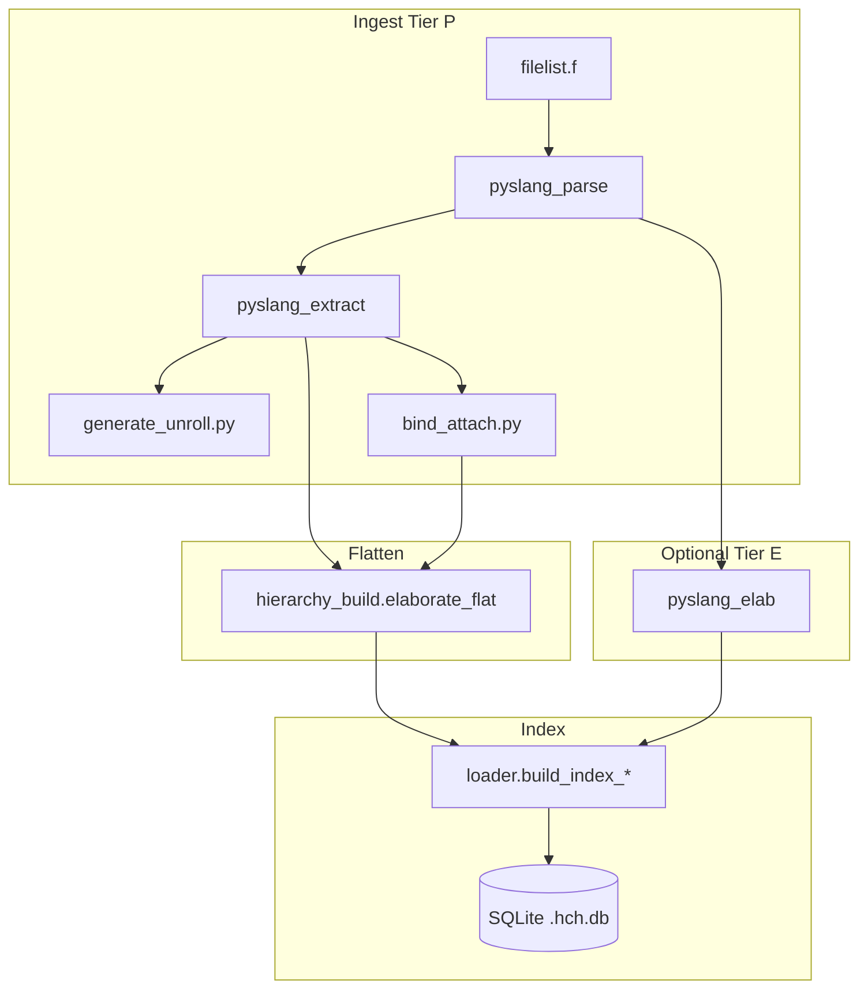
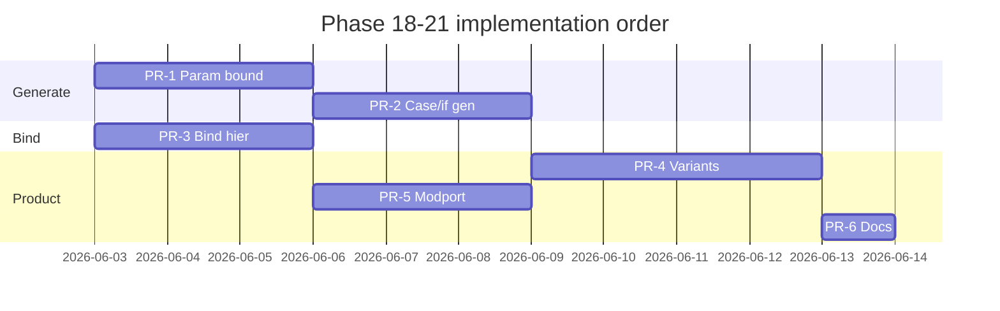

# Parsing Phase 18–21 Design — Remaining SV Grammar (Tier P + Index)

| Field | Value |
|-------|--------|
| Status | **Implemented (Phases 18–21)** |
| Date | 2026-06-02 |
| Scope | `hc_hierarchy` — pyslang Tier P extract, flatten, SQLite index, DQL |
| Related | `docs/PARSING_GAP_PLAN.md`, `docs/INDEXING.md`, Phase 10–17 |

---

## Overview

Phases 10–17 closed the planned parsing roadmap for filelist compile context, structural extract, Tier E polish, P2 metadata, and **literal** `for` generate unroll (Phase 17). Real SoC RTL still fails Tier P when generate bounds are **parameter expressions**, when hierarchy comes from **`case` generate** or **hierarchical `bind`**, or when teams need **multiple preprocessor variants** in one workflow.

This design sequences four incremental phases (18–21) that close the highest-impact **grammar/parsing** gaps without expanding into VHDL/UPF or full LRM library mapping.

---

## Background & Motivation

### Current state (accurate as of Phase 17)

| Capability | Tier P | Tier E (`--elaborate`) |
|------------|--------|-------------------------|
| `for (gi=0; gi<2; gi++)` literal loop | ✅ `gen_loop[i]` paths | ✅ |
| `for (gi=0; gi<DEPTH; gi++)` param bound | ❌ single/fallback edge | ✅ |
| `case` / non-const `if` generate | ❌ | ✅ |
| `bind sub.u_sub leaf` path | △ meta only | △ |
| ifdef multi-variant index | △ `--ifdef-compare` diff | △ |
| modport instance | ❌ | partial |

### Pain points

1. Users index large designs in **Tier P only** (speed, elab failure) and miss replicated generate cells.
2. **Bind** under a specific instance does not appear under `sub.u_sub` in `full_path`.
3. CI cannot compare **two full hierarchies** for different `+define+` sets without two DB builds and external diff.
4. Interface-centric SoCs lose **modport** identity in structural graphs.

---

## Goals & Non-Goals

### Goals

- **G1** — Tier P: unroll generate when loop bound resolves from **module parameters** (and simple localparam literals).
- **G2** — Tier P: walk **`case` generate** with constant case items; tag unknown arms.
- **G3** — Flatten/bind: materialize paths under **`bind_target_hier`** (e.g. `top.sub.u_sub.u_bind`).
- **G4** — Batch API: optional **multi-variant** index (`defines` → separate subgraph or tagged rows) + diff meta.
- **G5** — Extract **modport** connections; stable `child_type` for type-parameter instances.
- **G6** — Each phase ships tests + `scripts/verify_phaseN.sh`; update `PARSING_GAP_PLAN.md`.

### Non-Goals

- VHDL, UPF, SDF, struct-member hierarchy nodes (§G in gap plan).
- Full macro expansion AST (only improved tagging + optional preprocessed second pass later).
- Replacing pyslang or implementing a custom SV parser.
- Default full-chip Tier E elaboration.

---

## Proposed Architecture



**Principle:** Tier P gains **conservative constant folding** from `ModuleRecord.parameters` before falling back to single-edge behavior. Tier E remains the correctness backstop when folding fails.

---

## Phase 18 — Generate grammar completion (B1 extension)

### 18.1 Parametric loop bounds

**Problem:** `generate_unroll.loop_indices_for_generate()` returns `[lo]` when `stopExpr` is not an integer literal (e.g. `gi < DEPTH`).

**Approach:**

1. Add `resolve_parameter_expression(expr, param_map: Dict[str, str]) -> Optional[int]` in `generate_unroll.py`:
   - Literals (existing).
   - Identifier → lookup `param_map` (module header + defparam merged on `ModuleRecord`).
   - Simple binary: `A + B`, `A - B`, `A * B` when both sides resolve to int.
   - Width forms: `` `DEPTH `` or `parameter` refs only — no genvar algebra across modules in v1.
2. Pass `param_map` into `_walk_nested_items` from enclosing `ModuleRecord` when entering `LoopGenerate`.
3. If bound resolves and iteration count ≤ `MAX_GENERATE_LOOP` (256): unroll as today.
4. If bound does not resolve: emit **one** edge with `generate_path=label` (no `[i]`) and set meta `generate_param_bound_unresolved_count`.

**Files:** `generate_unroll.py`, `pyslang_extract.py`, `ingest.py` (meta), `loader.py` (`tier_p_generate_unrolled`).

**Fixture:**

```verilog
module child; endmodule
module top #(parameter DEPTH = 2);
  genvar i;
  generate
    for (i = 0; i < DEPTH; i++) begin : g
      child u();
    end
  endgenerate
endmodule
```

**Expected paths:** `top.g[0].u`, `top.g[1].u`.

### 18.2 `case` generate (constant arms)

**Approach:**

1. In `_walk_nested_items`, handle `CaseGenerate`:
   - For each `case item`, if condition is integer literal (or `default` when no other arm taken in v1: walk all literal arms — conservative for indexing).
   - Append path segment `case_label` or `case_0`, `case_1` from item value.
   - **v1 conservative:** walk every arm whose expression is a compile-time literal; do not evaluate `unique case` priority.
2. Meta: `case_generate_arm_count`.

**Alternative rejected:** Only walk first arm — breaks multi-hot case blocks used for tie-off.

### 18.3 `if` generate beyond `if (1)`

Extend `_if_generate_skip_else` into `_if_generate_active_branch(node, param_map) -> Optional[Literal|None]`:
- `if (0)` → skip if branch, walk else.
- `if (PARAM)` → resolve PARAM as 0/non-zero.
- Unknown → walk **both** branches with `generate_path` suffix `.if` / `.else` and tag `generate_branch_ambiguous=1` on edges.

### Verification

- `tests/phase18/test_generate_param_case.py`
- `scripts/verify_phase18.sh` → phase18 + phase17 regression

---

## Phase 19 — Hierarchical bind paths (B5, D6 partial)

### Problem

`BindEdge.target_hier_path = "sub.u_sub"` but `_attach_bind_instance` sets `parent_module=bind.target_module` (module name only) → flatten yields `sub.u_bind`, not `sub.u_sub.u_bind`.

### Approach

1. **`bind_attach.py`** (new):
   - `resolve_bind_parent_path(target_hier, mod_map, flat_context) -> (parent_module, parent_inst_path_prefix)`.
   - Split `target_hier` into module + instance tail: `sub` + `u_sub`.
2. **Extract:** store `bind_parent_hier_path` on `InstanceEdge` (or encode in `generate_path`-like field `bind_anchor_path`).
3. **Flatten (`hierarchy_build.walk`):**
   - When `edge.via_bind` and `edge.bind_target_hier`:
     - Resolve anchor flat path: walk module graph to `sub.u_sub` then append `.{inst_name}`.
   - If anchor not found: fallback current behavior + `meta.bind_anchor_miss_count`.
4. **Tier E (optional in 19b):** post-process elab paths: regex-merge bind instances from Tier P edges — defer to 19b if elab visitor change is large.

### Data model

```python
# schema.InstanceEdge (additive)
bind_anchor_path: str = ""  # e.g. "u_sub" under target module
```

### Verification

- Extend `design/extras/parse_bind/` with `bind sub.u_sub leaf u_l();`
- `tests/phase19/test_bind_hier_paths.py`

---

## Phase 20 — Multi-variant preprocessor index (A4, B7)

### Problem

One DB = one `defines_json`. Teams want `+define+FOO=1` vs `+define+FOO=2` hierarchy diff in CI.

### Approach (v1 — dual-pass, single DB)

**Not** full N-variant Cartesian product in v1.

1. CLI: `hch-index top.f --variant NAME:DEFINE1=1,DEFINE2=0` (repeatable) **or** `--variants-file variants.json`.
2. For each variant:
   - Run `ingest_filelist` with merged defines.
   - Flatten with prefix `full_path` → `vNAME:{original_path}` **or** store `variant` column on `instances` (schema migration).
3. **Recommended:** add `instances.variant TEXT DEFAULT ''` + composite unique `(variant, full_path)`.
4. Meta: `variants_json` list; `variant_diff_json` when `--variant-compare A,B`.
5. Reuse logic from `ifdef_batch.compare_ifdef_for_index` generalized to variant paths.

**Alternative considered:** separate `.hch.db` per variant — simpler but poor DQL UX; rejected for v1 product.

### Migration

```sql
ALTER TABLE instances ADD COLUMN variant TEXT DEFAULT '';
CREATE UNIQUE INDEX idx_instances_variant_path ON instances(variant, full_path);
```

### Verification

- `tests/phase20/test_variant_index.py` using `gen_ifdef_generate` + `USE_ALT`

---

## Phase 21 — Interface modport & type parameters (B10, B11)

### 21.1 Modport

1. Detect `ModportInstance` / interface port syntax in pyslang (probe AST kinds).
2. `InstanceEdge.child_kind = "modport"`, `child_type = "intf.modport_name"`.
3. DQL: `child_kind = "modport"` (document in `DQL_RULES.md`).

### 21.2 Parameterized type `#(.T(my_pkg::t))`

1. Normalize `syntax_text(type)` → strip to `child_module` + store full `#(...)` in `child_type`.
2. Include type param hash in `param_signature()` for dedup when needed.

### Verification

- `design/extras/sv_interface/` extend with modport instance
- `tests/phase21/test_modport_type_param.py`

---

## API / CLI Changes

| Flag | Phase | Description |
|------|-------|-------------|
| `--generate-max-unroll N` | 18 | Override 256 loop cap |
| `--variant NAME=defs` | 20 | Repeatable variant ingest |
| `--variant-compare A,B` | 20 | Diff instance sets in meta |

Existing: `--elaborate`, `--path-hierarchy`, `--ifdef-compare`, `--filelist-diff` unchanged.

---

## Meta keys (new)

| Key | Phase |
|-----|-------|
| `generate_param_bound_unresolved_count` | 18 |
| `case_generate_arm_count` | 18 |
| `generate_branch_ambiguous_count` | 18 |
| `bind_anchor_miss_count` | 19 |
| `variants_json` | 20 |
| `variant_diff_json` | 20 |
| `modport_instance_count` | 21 |

---

## Observability

- All new counters exposed via `/api/meta` (`db_service.json_keys`).
- `parse_tier_badge` unchanged; add footnote in web meta panel for variant count when present.

---

## Risks & Mitigations

| Risk | Severity | Mitigation |
|------|----------|------------|
| Param fold wrong → false extra instances | Major | Golden tests; compare Tier E subset in CI |
| `case` generate over-approximation | Medium | Document conservative walk; meta arm count |
| Variant column migration breaks old DB | Medium | `_migrate()` in `HierarchyStore` |
| Bind anchor missing in partial elab | Medium | Fallback + `bind_anchor_miss_count` |

---

## Rollout

1. Ship phases **18 → 19 → 20 → 21** sequentially (PR stack).
2. Update `PARSING_GAP_PLAN.md` §1 executive summary after each phase.
3. No feature flag required; behavior changes guarded by tests.

---

## Open Questions

1. **Case generate v1:** walk all literal arms vs only `default` + first matching — **proposal: all literal arms** (user confirm if strict LRM priority needed).
2. **Variant storage:** column on `instances` vs path prefix — **proposal: column** (cleaner DQL).
3. **Phase 19b Tier E bind:** same PR as 19 or follow-up — **proposal: 19 Tier P only, 19b elab optional**.

---

## Key Decisions

| # | Decision | Rationale |
|---|----------|-----------|
| K1 | Parameter folding only on current module `parameters` map | Avoids cross-module elab; cheap and covers 80% SoC `parameter DEPTH` patterns |
| K2 | Conservative `case` generate (all literal arms) | Indexing prefers over-approximation to missing hierarchy |
| K3 | Bind fix in flatten, not extract-only | Paths are a flatten product; extract already has `bind_target_hier` |
| K4 | Variant = DB column, not separate DBs | Enables single DQL connection and variant compare |
| K5 | Keep Tier E as backstop | No change to elab ownership; Tier P must degrade gracefully |

---

## PR Plan

### PR-1 — Phase 18a: Parametric generate loop bounds

- **Files:** `src/hch/ingest/generate_unroll.py`, `pyslang_extract.py`, `ingest.py`, `loader.py`, `docs/INDEXING.md`
- **Tests:** `tests/phase18/test_generate_param_bound.py`, `design/extras/parse_gen_param/`
- **Deps:** none

### PR-2 — Phase 18b: Case + extended if generate

- **Files:** `pyslang_extract.py`, `generate_unroll.py` (shared expr resolver)
- **Tests:** `tests/phase18/test_generate_case_if.py`
- **Deps:** PR-1 (shared resolver)

### PR-3 — Phase 19: Hierarchical bind flatten

- **Files:** `schema.py`, `bind_attach.py`, `hierarchy_build.py`, `store.py`, `pyslang_extract.py`
- **Tests:** `tests/phase19/`, `design/extras/parse_bind/rtl/bind_hier.v`
- **Deps:** none (parallel to PR-2 after PR-1)

### PR-4 — Phase 20: Variant column + CLI

- **Files:** `schema_sql.py`, `store.py`, `loader.py`, `index_cli.py`, `ifdef_batch.py` (generalize)
- **Tests:** `tests/phase20/`
- **Deps:** none

### PR-5 — Phase 21: Modport + type param

- **Files:** `pyslang_extract.py`, `parse_tags.py`, `docs/DQL_RULES.md`
- **Tests:** `tests/phase21/`
- **Deps:** none

### PR-6 — Docs sync

- **Files:** `PARSING_GAP_PLAN.md` (§1–2 refresh), `REMAINING.md`, `PARSE_PHASE18_21_DESIGN.md` status → Implemented per phase
- **Deps:** PR-1..5



---

## References

- `docs/PARSING_GAP_PLAN.md` — gap IDs B1, B5, B7, A4, B10, B11, D6
- `src/hch/ingest/generate_unroll.py` — Phase 17 literal unroll
- `tests/phase17/test_generate_loop_unroll.py`
- `tests/phase14/test_remaining_parse.py` — ifdef compare precedent