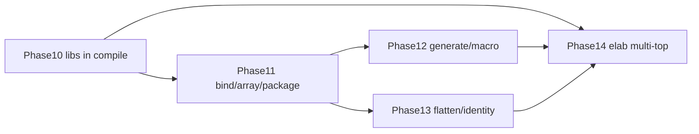

# Parsing gap inventory & roadmap

Work root: `hc_hierarchy`.  
Scope: **SystemVerilog/Verilog hierarchy indexing** (pyslang Tier P / Tier E / path heuristic).  
Out of scope (document only): VHDL, UPF/SDF, struct-member nodes, gate-level netlist.

**Indexing v1 closed (2026-06):** `docs/TIER_CONTRACT.md`, `docs/REMAINING.md` (v2 only).  
Phases 10–28 implemented; remaining gap IDs below are **v2** unless marked *won't fix*.

| v1 won't fix | v2 defer |
|--------------|----------|
| 991-file full slang on duplicate corpus | B7 multi-variant DB |
| Full macro expansion AST | A7 work libraries |
| VHDL / UPF / SDF | GUI macro highlight |

---

## 1. Executive summary

| Area | Maturity | Biggest risk |
|------|----------|--------------|
| Filelist / compile context | Good | Exotic opts (`+ntb`) skipped; no work-lib (A7) |
| Tier P structural extract | Good | Parametric/case generate, bind path, modport (→ Phase 18–21) |
| Tier E elaboration | Good on small tops | libs missing → silent fallback |
| Flatten / path materialization | Good | `path_hierarchy` heuristic on non-`soc_top` RTL |
| Identity (multi-def / param) | Medium | `module_ref` DQL; merge still one node per name |

**Next design:** `docs/PARSE_PHASE18_21_DESIGN.md` (Phases 18–21).

Phases **10–17 done** (libs in compile, bind/package, literal generate unroll, Tier E param merge, P2 meta).

---

## 2. Gap inventory (complete)

Severity: **P0** user-visible wrong/missing hierarchy · **P1** common SoC gap · **P2** edge / polish · **P3** intentional defer.

### A. Filelist & compilation context

| ID | Gap | Severity | Current behavior | Target |
|----|-----|----------|------------------|--------|
| A1 | `-y`/`-v` not in `parse_config` / `elaborate_instances` | P0 | Regex stub scan (`library_scan`) only | Pass libs to slang; stub on unresolved |
| A2 | `+librescan`, `+libdir`, `-sverilog`, timescale, `-ntb` | P1 | Ignored / skipped | Parse + forward or `meta.unsupported_filelist_opts` |
| A3 | Multi-top / `-top` in `.f` | P1 | CLI `--top` only | Filelist `top` + multi-root index meta |
| A4 | Single preprocessor variant per DB | P1 | One `defines_json` | Optional variant index or compare API (extend `ifdef_variant`) |
| A5 | `.vh/.svh` include-only vs compile | P2 | Only explicit sources in `.f` | Document; optional `+incdir` compile of headers |
| A6 | Nested `-f` / env `$VAR` errors | P2 | `filelist_errors` partial | Golden filelist torture tests |
| A7 | Work library / separate compile units | P2 | Flat source list | Map `cell` → lib; defer full LRM |

### B. Tier P — syntax extract (`pyslang_extract.py`)

| ID | Gap | Severity | Current behavior | Target |
|----|-----|----------|------------------|--------|
| B1 | **Generate not in paths** | P0 | ~~One edge per inst~~ | Tier P: `for` loop literal unroll (`gen_loop[i]`); Tier E full |
| B2 | **Generate else branch** in syntax | P1 | Inactive `else` still walked (`u_spi` in test) | Walk only taken branch when const-fold visible; else tag `unreachable` |
| B3 | **Instance array** non-literal / wide | P0 | `u[0:1]` → single `u`; max 64 literals | Expand interface arrays; param ranges → `u[lo:hi]` leaf |
| B4 | **Top-level `bind`** | P0 | Only `bind` inside module body | Walk `root.members` `BindDirective` |
| B5 | **`bind` hierarchical target** | P1 | `target` string only; `targetInstances` ignored | `bind sub.u leaf` → attach under instance path |
| B6 | **Macro-generated hierarchy** | P1 | `from_macro` rarely set; no expansion | Preprocess pass or slang macro AST; count in meta |
| B7 | **ifdef inactive branches** | P1 | Invisible (one variant) | Multi-variant ingest job; `ifdef_variant` diff in CI |
| B8 | **Package** | P1 | `PackageDeclaration` skipped | Index package scope; `pkg::type` normalization |
| B9 | **Config / compilation unit** | P2 | Not modeled | Document limitation |
| B10 | **Modport / virtual interface** | P1 | `bus_if` as module; modport inst lost | `child_kind=interface`, modport name in meta |
| B11 | **Parameterized type** `#(.T(...))`** | P1 | Last token of type string | Stable `child_type` field + param sig |
| B12 | **Port connect graph** | P2 | Port names on module only | Optional `port_connections` on edges |
| B13 | **defparam / localparam / specparam** | P2 | Module `parameters` header/local only | defparam → override map; warn in meta |
| B14 | **Primitives / UDP / `celldefine`** | P2 | Treated as missing module | `module_kind=primitive` or blackbox |
| B15 | **DPI / extern / alias** | P3 | Not special-cased | Document |
| B16 | **Parse diagnostics** | P1 | Syntax parse throws; no per-file meta | `parse_errors_json` from slang diags |

### C. Tier E — elaboration (`pyslang_elab.py`)

| ID | Gap | Severity | Current behavior | Target |
|----|-----|----------|------------------|--------|
| C1 | Libraries omitted from compile | P0 | Same as A1 | `library_files` + dirs in `PyslangParseConfig` |
| C2 | **Partial elab** | P1 | All-or-nothing instances | Keep partial subtree + warnings |
| C3 | **Generate explosion** | P1 | No cap | `meta.elab_instance_cap`, truncate + warn |
| C4 | **Multi-top** | P1 | Filter `topInstances` by name | Index all tops or `--tops a,b` |
| C5 | **param on flat rows** | P2 | ~~Tier E flat lacks `param_overrides`~~ | Phase 16: elab symbols + Tier P merge |
| C6 | **Interface elab paths** | P2 | Same visitor as modules | Golden `top_if` Tier E paths |
| C7 | **Blackbox in elab** | P1 | Unresolved → fallback | slang `celldefine` / empty module lib |

### D. Flatten & path inference

| ID | Gap | Severity | Current behavior | Target |
|----|-----|----------|------------------|--------|
| D1 | **path_hierarchy** heuristic | P0 | Only `soc_top` + `u_*` depth≥10 | Explicit `--path-hierarchy` or auto-detect meta flag |
| D2 | **Cycles / parameter recursion** | P1 | Unchecked DFS | Cycle detect; `meta.flatten_warnings` |
| D3 | **Unresolved as flat nodes** | P2 | Empty `file` placeholder | `module_kind=unresolved` + DQL filter |
| D4 | **Multi-def same name** | P1 | `_definition_paths` not in DB | `module_ref` in DQL; pick def by instance file |
| D5 | **Tier P + path mix** | P1 | `hierarchy_source=path` hides AST gaps | `path_augmented=1` meta when edges added |
| D6 | **Bind not in Tier E paths** | P1 | AST bind only Tier P | Elab visitor includes bind instances |

### E. Merge, identity, query surface

| ID | Gap | Severity | Current behavior | Target |
|----|-----|----------|------------------|--------|
| E1 | **module_name collision** | P1 | Dict key = name | Secondary index by `module_ref` / file |
| E2 | **param signature in DB** | P2 | `param_json` on instance | DQL `param` already; document Tier P limits |
| E3 | **Blackbox vs RTL order** | P2 | merge prefers non-blackbox | Test + document ingest order |
| E4 | **inst_json tags not round-tripped** | P2 | `load_all_modules` drops tags | Persist `in_generate`, `via_bind` in JSON |

### F. Observability & product

| ID | Gap | Severity | Current behavior | Target |
|----|-----|----------|------------------|--------|
| F1 | `macro_instance_count` not in meta | P2 | Field on extractor only | Export in `_apply_parse_meta` |
| F2 | Per-source parse status | P1 | batch checkpoint files only | `source_status_json` |
| F3 | Web/GUI parse tier badge | P2 | Some meta in API | Show `hierarchy_source`, caps, unresolved |

### G. Intentionally not planned (reference)

- VHDL, UPF, SDF  
- Struct/union member as hierarchy nodes  
- Analog/mixed-signal, SPICE  
- Full LRM library mapper without slang  

---

## 3. Phased roadmap

### Phase 10 — Compile context (A1, A2, C1, C7) — **done**

| Task | Status |
|------|--------|
| `PyslangParseConfig` + `filelist_lines` (`-y`, `-v`, `+libext+`) | done |
| `config_from_filelist` / `configure_driver` | done |
| Tier P + Tier E share preprocessing | done |
| Verify | `tests/phase10/test_library_compile.py` |

### Phase 11 — Structural extract hardening (B3, B4, B5, B8, B10, B16) — **done (core)**

**Goal:** Fewer silent misses on real SV RTL.

| Task | Status |
|------|--------|
| Top-level + in-module `bind` | done — `design/extras/parse_bind/` |
| Interface instance array expand | done |
| Package index (`module_kind=package`) | done |
| Parse diagnostic counts in meta | done |
| Verify | `tests/phase11/test_extract_hardening.py` |

### Phase 12 — Generate & macro fidelity (B1, B2, B6, B7, C3) — **done**

**Goal:** Predictable generate semantics; optional multi-variant.

| Task | Status |
|------|--------|
| Tier P `generate_path` in flatten | done |
| `macro_instance_count` meta | done |
| ifdef multi-variant (`--ifdef-compare`) / elab cap | done |
| Verify | `tests/phase12/test_generate_paths.py` |

### Phase 13 — Flatten & identity (D1–D5, E1, E4) — **done**

**Goal:** Correct graph on collision and synthetic RTL.

| Task | Status |
|------|--------|
| CLI `--path-hierarchy auto|on|off` | done |
| Cycle guard in `elaborate_flat` | done |
| `module_ref` DQL / store round-trip | done |
| Verify | `tests/phase13/test_path_hierarchy_mode.py` |

### Phase 14 — Elab & multi-top polish (A3, C2, C4–C6, D6) — **done**

**Goal:** Production-like tops and partial success.

| Task | Status |
|------|--------|
| `--tops` multi-root flatten | done |
| Partial elab + cap meta | done |
| Tier E interface paths | done — `test_tier_e_interface_elab_paths` |
| Verify | `tests/phase14/test_remaining_parse.py` |

### Phase 15 — P2 polish (B12–B14, E4, F3, A2 meta, A5, D3) — **done**

**Goal:** Edge-case extract metadata, filelist diff, flatten cycle signal, API badge.

| Task | Status |
|------|--------|
| Port connections on instance edges (`port_connections`) | done |
| defparam → module `parameters` + `defparam_count` meta | done |
| Primitives (`module_kind=primitive`, `child_type`) | done |
| `inst_json` round-trip (`bind_target_hier`, tags) | done |
| `+libdir` / `+librescan` / `-sverilog` / `+ntb` filelist | done — unsupported opts meta |
| `--filelist-diff` → `filelist_diff_json` | done |
| Flatten cycle / cap → `flatten_cycle_warning` | done |
| Web `parse_tier_badge` in `/api/meta` | done |
| Verify | `tests/phase15/test_p2_parse.py`, `scripts/verify_phase15.sh` |

### Phase 18–21 — Parsing grammar completion — **done**

| Phase | Focus | Verify |
|-------|--------|--------|
| 18 | Parametric + case/if generate (Tier P) | `tests/phase18/`, `verify_phase18.sh` |
| 19 | Hierarchical bind flatten | `tests/phase19/`, `verify_phase19.sh` |
| 20 | Multi-variant index (`instances.variant`) | `tests/phase20/`, `verify_phase20.sh` |
| 21 | Interface/modport index | `tests/phase21/`, `verify_phase21.sh` |

Design: **`docs/PARSE_PHASE18_21_DESIGN.md`**

### Phase 22 — Parse polish (bind E, macro, while, loop step) — **done**

| Task | Status |
|------|--------|
| Tier E + Tier P bind row merge (`elab_bind_merge.py`) | done |
| Macro instance tagging (`macro_tag.py`) + `macro_definition_count` | done |
| `while` generate placeholder (`wg[0]`, skipped-token detect) | done |
| `for` step `i = i + N` in `generate_unroll.py` | done |
| `ParameterDeclarationStatement` body parameters | done |
| Verify | `tests/phase22/`, `scripts/verify_phase22.sh` |

### Phase 23 — Parametric arrays, while unroll, ifdef multi-DB — **done**

| Task | Status |
|------|--------|
| Parametric instance array `u[N-1:0]` (`instance_array_expand.py`) | done |
| `while (i < N)` bounded unroll (skipped-token) | done |
| `--variant-dir` per-variant SQLite + manifest | done |
| Verify | `tests/phase23/`, `scripts/verify_phase23.sh` |

### Phase 24 — Flatten warnings & generate unreachable (B2, D2) — **done**

| Task | Status |
|------|--------|
| `flatten_warnings_json` (cycle, visit cap, unresolved) | done |
| Inactive generate else/if branch counted, not indexed (`generate_unreachable_edge_count`) | done |
| Flatten skips `InstanceEdge.unreachable` when stored | done |
| Verify | `tests/phase24/`, `scripts/verify_phase24.sh` |

### Phase 25 — Ambiguous generate, unresolved flat, tag round-trip (B2, D3, E4) — **done**

| Task | Status |
|------|--------|
| Ambiguous `if` → `if_true` / `if_false` `generate_branch` + meta count | done |
| Unresolved child flat row (`is_unresolved`, no bogus recurse) | done |
| `inst_tags_json` + `child_kind` on `instances`; `load_flat_instances()` | done |
| `export_instance_dicts()` includes tags | done |
| Verify | `tests/phase25/`, `scripts/verify_phase25.sh` |

### Phase 26 — Remaining P1/P2 gaps (A3, A7, B8, B16, D4, E3, DQL) — **done**

| Task | Status |
|------|--------|
| Filelist `-top` / `+top+` → `filelist_top_modules_json` | done |
| Work library `-work` meta + `library_cell_map_json` (A7 light) | done |
| Package symbol index (`param_*`, `typedef_*`) + `pkg::` type normalize (B8) | done |
| `parse_errors_json` per source file (B16) | done |
| `multi_def_modules_json` + `_definition_paths` in merge (D4) | done |
| Blackbox vs RTL merge preference test (E3) | done |
| DQL `child_kind` filter | done |
| Verify | `tests/phase26/`, `scripts/verify_phase26.sh` |

### Phase 17 — Tier P generate loop unroll (B1) — **done**

| Task | Status |
|------|--------|
| Literal `for (genvar = lo; cond; step)` unroll in extract | done — `generate_unroll.py` |
| Flatten paths `top.gen_blk.gen_loop[0].u` | done |
| Meta `tier_p_generate_unrolled`, `generate_loop_unroll_count` | done |
| Verify | `tests/phase17/test_generate_loop_unroll.py` |

### Phase 16 — C5 Tier E parameter merge — **done**

**Goal:** Elaborated flat rows expose resolved parameters; Tier P ``#()`` fills gaps.

| Task | Status |
|------|--------|
| `parameters_from_instance_symbol` (pyslang `body.parameters`) | done |
| `ElabInstance.param_overrides` + `flat_instances_from_elab` | done |
| Tier P merge via `elab_param_merge.py` | done |
| Meta `elab_param_instance_count`, `tier_e_param_merge` | done |
| Verify | `tests/phase16/test_elab_param_merge.py` |

---

## 4. Priority matrix (what to do first)

```text
P0 now:  A1, B3, B4, B1 (document + Tier E), D1 (explicit control)
P1 next: B5, B7, B8, C1, D4, F2
P2 later: ~~B12–B14, C5, E4, F3~~ → Phase 15–16 done
P3 defer: A7, B15, G.*
```

---

## 5. Verification strategy

| Layer | Command / artifact |
|-------|-------------------|
| Unit extract | `tests/phase10/`, `tests/phase11/` per feature |
| Regression | `pytest tests/phase6/ tests/phase9/ -q` |
| Integration | `design/extras/*`, `design/multihost_peri_soc/quick.f` |
| Stress | `pytest -m slow` synthetic elab (optional CI) |
| Docs | Update `INDEXING.md` meta table each phase |

Proposed script: `scripts/verify_phase10.sh` → `pytest tests/phase10/ tests/phase9/ -q`.

---

## 6. Dependency graph



---

## 7. Relation to existing docs

| Doc | Role |
|-----|------|
| `PARSE_ENHANCEMENT_PLAN.md` | Tracks 1–4 **done** |
| `SV_ENHANCEMENT_PLAN.md` | Phase6 items **done** |
| `REMAINING.md` | Product/DQL; not parsing |
| **This file** | Full parsing gap list + phases 10–17 |
| `PARSE_PHASE18_21_DESIGN.md` | Phases 18–21 implementation design + PR plan |

---

## 8. Quick wins (< 1 day each)

1. Export `macro_instance_count` to meta (F1).  
2. Walk compilation-unit `BindDirective` (B4).  
3. Expand interface inst arrays like module arrays (B3).  
4. Pass `library_*` into `PyslangParseConfig` (A1/C1).  
5. Add `path_hierarchy_mode` CLI flag (D1).  

---

*Last updated: 2026-06-02 — audit after phase9.*