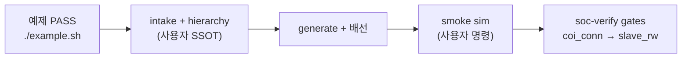

# VERIF-CPU-SOC — VCPU→SoC 통합 사용자 절차서

> **대상:** SoC/DV 엔지니어 (도구를 처음 쓰는 사람)  
> **목적:** VerifCPU 기본 예제 PASS 이후, **내 SoC top**에 SCPU 검증 블록을 올리고 soc-verify-agent gate까지 통과하는 단계별 절차  
> **LLM 에이전트용 문서는 아닙니다** — 에이전트는 Obsidian vault를 따릅니다.

**5분 시작** (최초 1회):

```bash
export PROJECT_DIR=/path/to/soc-verify-agent/projects/VERIF-CPU-SOC
cd "$PROJECT_DIR"
./scripts/bootstrap_verifcpu_workspace.sh   # 기본: ~/tools/__CFA/VerifCPU/verif_cpu_verilog
cd inputs/tags && ./copy_new_tag.sh my_chip
```

이후 §3–§9 순서대로 진행합니다.

---

## 1. 이 도구가 무엇인가

VerifCPU 저장소에서 `./example.sh`와 `make full_campaign`이 **PASS**했다고 해서 **내 칩 통합이 끝난 것은 아닙니다.**  
두 계층이 분리되어 있습니다.

| 계층 | 역할 | 대표 산출물 |
|------|------|-------------|
| **VerifCPU** (`$RTL_ROOT`) | 펌웨어·campaign·TB 생성, 예제 `chip_top_example` 회귀 | `soc_hierarchy_*.yaml`, `.vh`, `.hex` |
| **soc-verify-agent** (이 프로젝트) | intake·gate·재현 스크립트로 **통합 검증** | `customer_soc_intake.yaml`, `scripts/0*_*.sh` |

기본 예제는 `simple_soc` / `chip_top_example`에 고정 배선되어 있습니다.  
**처음 통합할 때는** 복잡한 `chip_top_example` 대신 **`make soc-paste`** + `$RTL_ROOT/integration_paste.md` 를 권장합니다 — **1슬롯·포트 직결·복붙** 패턴입니다.

내 SoC는 **과제 interconnect 포트명·주소맵·top**에 맞게 hierarchy YAML 작성 → generate → top 배선 → smoke sim → formal gate 순으로 진행합니다.



---

## 2. 선행 조건 (Prerequisites)

| 항목 | 용도 | 확인 예 |
|------|------|---------|
| `git` | VerifCPU clone | `git --version` |
| `python3` | ops·crystallize | `python3 --version` |
| `iverilog`, `vvp` | VerifCPU 참조 sim (또는 사이트 EDA) | `iverilog -V` |
| RISC-V gcc | 펌웨어 빌드 | `riscv64-unknown-elf-gcc --version` |
| `hier-walk` (gate Step 2) | COI instance 스캔 | `HIERWALK_PATH=~/tools/__CFA/hierwalk pip install -e "$HIERWALK_PATH"` |

사이트에서 Questa/VCS 등을 쓰면 intake `simulation` 블록에 그에 맞게 적어 둡니다.

---

## 3. 최초 1회 설정 (S0)

**목표:** VerifCPU RTL 경로(`RTL_ROOT`)를 확정합니다. 로컬 SSOT는 **`~/tools/__CFA/VerifCPU/verif_cpu_verilog`** 입니다.

```bash
cd projects/VERIF-CPU-SOC   # soc-verify-agent 저장소 기준
./scripts/bootstrap_verifcpu_workspace.sh
```

`discovered.yaml`의 `local_clone_path: ~/tools/__CFA`가 있으면 **clone 없이** 위 경로를 `cache.yaml`에 등록합니다.  
다른 위치·원격 clone이 필요할 때만:

```bash
./scripts/bootstrap_verifcpu_workspace.sh --tag v1.2.0
./scripts/bootstrap_verifcpu_workspace.sh --dest ~/tools/__CFA/VerifCPU/verif_cpu_verilog
```

**RTL_ROOT 확인** (`clone.path` = `~/tools/__CFA` + `rtl_subdir` = `VerifCPU/verif_cpu_verilog`):

```bash
export RTL_ROOT="$(python3 -c "import sys; sys.path.insert(0,'.'); from ops.intake_resolve import resolve_rtl_root; print(resolve_rtl_root(__import__('pathlib').Path('.')))")"
echo "$RTL_ROOT"
test -f "$RTL_ROOT/example.sh" && echo "RTL_ROOT OK"
```

`example.sh`가 없으면 경로 오류입니다. `~/tools/__CFA/VerifCPU/verif_cpu_verilog` 존재 여부 또는 `--dest`를 확인하세요.

### 3.1 copy-paste 통합 스모크 (권장 첫 단계)

회사 SoC CPU bus에 VCPU를 붙이기 전, **읽기 쉬운 1슬롯 예제**로 iverilog 검증:

```bash
cd "$RTL_ROOT"
make soc-paste    # tb/soc_cpu_bus_paste.v — 기대: soc_cpu_bus_paste: PASS
```

복사 블록 SSOT: `include/soc_cpu_bus_paste_fabric.vh` · 가이드: `integration_paste.md`  
바꿀 것 3가지: SoC 포트 prefix · `verif_vcpu_soc_cell_*` bus_type · peripheral base address.

---

## 4. 새 프로젝트·tag 스캐폴드

`./example.sh gen`은 **`.vh`·`.hex`·filelist**만 다시 씁니다.  
**MD·intake YAML·사람 메모**는 `copy_new_tag.sh`로 복사해야 합니다.

```bash
cd projects/VERIF-CPU-SOC/inputs/tags
./copy_new_tag.sh <NEW_TAG>                    # 빈 template (gate 기본값 false)
./copy_new_tag.sh <NEW_TAG> --from main        # 기존 tag intake 복사
./copy_new_tag.sh <NEW_TAG> --example          # dry-run 예시만 (참고용, 프로덕션 금지)
```

**복사되는 것 (gen이 만들지 않음):**

| 경로 | 역할 |
|------|------|
| `README.md` | tag 폴더 설명 |
| `manifest.yaml` | artifact 등록 SSOT |
| `deployment/integration_notes.md` | 시뮬·fw·배선 사람 메모 |
| `deployment/questions_pending.md` | 미확정 질문 |
| `deployment/customer_soc_intake.yaml` | 과제 intake (template/example에서 seed) |

`weekly_release/`, `sfr/`, `overrides/` 빈 폴더도 생성됩니다.

**VerifCPU 쪽 (칩별 SSOT):** 예제 YAML을 **복사**한 뒤 편집합니다. 예제 파일 직접 수정 금지.

```bash
cd "$RTL_ROOT/firmware/campaign"
cp soc_hierarchy_example.yaml soc_hierarchy_<MY_CHIP>.yaml
```

---

## 5. 사용자가 반드시 채울 것 — `customer_soc_intake.yaml`

경로: `inputs/tags/<TAG>/deployment/customer_soc_intake.yaml`

### 5.1 펌웨어 (`firmware`)

| 필드 | 사용자가 할 일 |
|------|----------------|
| `user_provided: true` | 과제용 C/헤더를 제공했음을 표시 |
| `paths.*` | `soc_regs.h`, `campaign_slots.yaml`, `common/`, `cpu_*/`, `icodes/` **실제 경로** |
| `staging.status: staged` | C 다발을 `firmware/campaign/`에 복사·슬롯 수 맞춤 완료 후 |

`soc_regs.h`의 `SFR_CTRL`, `SRAM_MARKER` 등이 **과제 SFR 맵**과 일치해야 icode·Phase B가 올바른 주소를 칩니다.

### 5.2 시뮬레이션 (`simulation`)

| 필드 | 사용자가 적는 내용 |
|------|-------------------|
| `user_documented: true` | 환경·실행법을 직접 문서화했음 |
| `environment.setup` | EDA·module·Docker·라이선스 준비 방법 |
| `environment.verify_cmd` | 환경 확인 한 줄 명령 |
| `run.smoke_after_integration` | **배선 직후** 실행 명령 (cwd·env 포함) |
| `pass.log_markers[]` | sim.log에서 PASS로 볼 문자열 |

`user_documented: true` 전에는 통합 직후 sim·formal gate를 진행하지 않습니다.

### 5.3 슬레이브 (`slaves[]`) — 슬레이브 1개당

| 필드 | 의미 | 예 |
|------|------|-----|
| `name` | 역할 | `DMA_CH3` |
| `cpu_id` | SCPU 번호 (1..N, master=0) | `37` |
| `tap_port` | agent snoop 채널 (≠ AXI 포트 번호) | `36` |
| `bus_type` | canonical key (`apb3`, `ahb_lite`, `axi4lite` …) | `axi4lite` |
| `bus_port` | interconnect **RTL 포트 prefix** | `S37_AXI` |
| `addr_base` / `addr_size` | 절대 주소 구간 | `0x4A000000`, `0x1000` |
| `targets[]` | 검증 레지스터 (`sym`, `expect`, `icode`) | Phase B/C 대상 |

**인덱스 규칙:** generate 블록 `g_slvN`에서 **N = cpu_id − 1**.

미확정 항목은 `questions_pending.md`에 적고, 확정 전 manifest·hierarchy 작성을 멈춥니다.

---

## 6. 통합 워크플로 (S0–S10, 사람용 요약)

**통합 난이도 3단계** — intake `chip.integration_tier`에 기록 (`paste` \| `yaml_multi` \| `scale`).

**SSOT (복붙 금지):**

- **Step 그래프 S0–S10:** vault [`03-WORKFLOW.md`](../../templates/obsidian/agent/vcpu-soc-integration/03-WORKFLOW.md)
- **tier 표·smoke·PASS 마커·S3/S4b/S5/S6 분기:** vault [`13-INTEGRATION-TIERS.md`](../../templates/obsidian/agent/vcpu-soc-integration/13-INTEGRATION-TIERS.md)
- **intake·simulation 동기화:** `scripts/sync_intake_simulation_tier.py` — vault [`02-INTAKE.md`](../../templates/obsidian/agent/vcpu-soc-integration/02-INTAKE.md)

아래는 **사람용 명령 예시**만 (tier 표·step 표 없음). tier 분기는 vault를 따른다.

### S1 — campaign + tier smoke

`chip.integration_tier`에 맞게 **하나만** 실행 — 명령 SSOT: `13-INTEGRATION-TIERS.md` §S1.

```bash
cd "$RTL_ROOT"
./example.sh gen
make full_campaign          # 43/43 — 항상

# integration_tier: paste (기본)
make soc-paste

# integration_tier: yaml_multi — 아래만 실행 (위 soc-paste 생략)
# make gen && make soc-integration

# integration_tier: scale — 아래만 실행
# make chip-top-example
```

### S4 — generate (공통)

```bash
cd "$RTL_ROOT/firmware/campaign"
make config NUM_SCPU=<N>
cd "$RTL_ROOT" && make gen
make -C firmware/campaign soc_init icodes
```

### S4b — tier 2 only

```bash
# firmware/campaign/soc_integration_ports.yaml 편집 (bus_port, bus_type, role)
cd "$RTL_ROOT" && make gen    # → include/soc_integration_example_gen.vh
```

### S5–S6 — tier 3 only

```bash
cd "$RTL_ROOT/firmware/campaign"
python3 gen_soc_bus_connect.py --yaml soc_hierarchy_<MY_CHIP>.yaml
python3 gen_tb_campaign.py --yaml soc_hierarchy_<MY_CHIP>.yaml
```

### S7 — top 배선

**Tier 1–2 (직결):**

1. `include/soc_cpu_bus_paste_fabric.vh` 또는 `soc_integration_example_gen.vh`의 `g_slvN` 블록을 과제 `chip_top`에 복사  
2. SoC 포트 prefix · `verif_vcpu_soc_cell_*` · peripheral base 치환  
3. CONNECT 매크로 **불필요**

**Tier 3 (CONNECT):**

1. `include/verif_soc_bus_connect.vh` include  
2. `CONNECT_SLV{cpu_id:02d}_*`가 과제 `Sxx_*` 포트명과 **문자열 일치**  
3. `verif_agent_slave`의 `TAP_PORT` = manifest `tap_port`  
4. orchestrator·snoop 4신호 (`valid, wr, addr, data`) 연결

신호·매크로 상세: `$RTL_ROOT/howto_integrate.md`

---

## 7. Generate vs Copy — 무엇을 누가 만드나

| 구분 | 사용자가 복사·작성·유지 (SSOT) | `./example.sh gen` 등이 재생성 | 에이전트/ops |
|------|-------------------------------|-------------------------------|--------------|
| soc-verify-agent tag | `integration_notes.md`, intake, `manifest.yaml` | — | crystallize, gate 실행 |
| hierarchy·펌웨어 | `soc_hierarchy_*.yaml`, `soc_regs.h`, `campaign_slots.yaml`, C/icodes | — | staging 복사 지원 |
| campaign gen | — | `tb_full_campaign_gen.vh`, `campaign_manifest.vh`, `.hex`, filelists | — |
| SoC 배선 VH | — | `verif_soc_bus_connect.vh` (S5), `chip_top_*_gen.vh` (S6) | — |
| 검증 gate | intake `simulation`, overrides | — | `01_`~`03_` 스크립트 |

**주의:** `soc_hierarchy_example.yaml`을 고객 값으로 **덮어쓰지 말고** 복사본 파일을 쓰세요.

---

## 8. 시뮬레이션 (S9)

배선(S7)과 probe(S8) **이후**, formal gate(S10) **이전**에 smoke sim을 돌립니다.

intake에 기록한 명령 예 (VerifCPU iverilog — **첫 통합은 soc-paste**):

```bash
export RTL_ROOT="${RTL_ROOT:-$(pwd)}"
cd "$RTL_ROOT"
make soc-paste 2>&1 | tee sim_smoke.log
grep -E 'soc_cpu_bus_paste: PASS|4 passed' sim_smoke.log
```

scale·yaml hierarchy 검증이 필요할 때만: `make chip-top-example` (16 checks).

Questa·사내 run 스크립트·고객 top injection은 **intake에 적은 명령만** 따릅니다.  
`pass.log_markers`가 log에 보일 때까지 S10으로 넘어가지 마세요.

---

## 9. 검증 gate (S10)

### 9.1 intake → gate 설정 반영 (crystallize)

```bash
cd projects/VERIF-CPU-SOC
# customer_soc_intake.yaml 이 이미 있으면 --intake 생략 가능
python3 scripts/crystallize_gate_from_intake.py
# 예시 intake로 dry-run만 할 때:
# python3 scripts/crystallize_gate_from_intake.py \
#   --intake inputs/tags/main/deployment/customer_soc_intake.example.yaml
python3 scripts/expand_agent_runbook.py \
  --intake inputs/tags/<TAG>/deployment/customer_soc_intake.yaml
```

산출 override:

| 파일 | 내용 |
|------|------|
| `inputs/tags/<TAG>/overrides/coi_conn_checks.json` | top·filelist·COI checks |
| `inputs/tags/<TAG>/overrides/slave_rw_scenarios.json` | slaves·sim PASS 마커·gate tier |

`02_*`·`03_*` gate 스크립트는 `customer_soc_intake.yaml`이 있으면 crystallize를 자동 호출합니다.

### 9.2 전체 gate 순서 (S9 PASS 후)

```bash
cd projects/VERIF-CPU-SOC
chmod +x scripts/*.sh inputs/tags/copy_new_tag.sh scripts/bootstrap_verifcpu_workspace.sh
./scripts/run_VERIF-CPU-SOC_verification_sequence.sh
```

| Step | 스크립트 | 검증 내용 |
|------|----------|-----------|
| 1 | `01_sanity_VerifCPU_c-compile_and_elab.sh` | 펌웨어 c-compile & elab |
| 2 | `02_static_COI_connectivity_chip_top.sh` | 정적 COI 연결 |
| 3 | `03_simulation_slave_R_W_single_burst_cpu_sync.sh` | 3-tier slave R/W sim |
| — | `99_generate_verification_reports.sh` | 보고서 MD 생성 |

단계만 다시 돌릴 때:

```bash
./scripts/01_sanity_VerifCPU_c-compile_and_elab.sh
./scripts/02_static_COI_connectivity_chip_top.sh
./scripts/03_simulation_slave_R_W_single_burst_cpu_sync.sh
```

내 `chip_top`을 쓰면 Step 2·3의 filelist/top·`coi_conn_checks.json`을 과제에 맞게 갱신해야 합니다 (`hier-walk`로 instance 경로 확인).

---

## 10. 명령 치트시트

```bash
# 변수 (한 세션에서 재사용)
export PROJECT_DIR=projects/VERIF-CPU-SOC
export TAG=<TAG>

# S0 — bootstrap
cd "$PROJECT_DIR" && ./scripts/bootstrap_verifcpu_workspace.sh
export RTL_ROOT="$(python3 -c "import sys; sys.path.insert(0,'.'); from ops.intake_resolve import resolve_rtl_root; print(resolve_rtl_root(__import__('pathlib').Path('.')))")"

# 새 tag
cd "$PROJECT_DIR/inputs/tags" && ./copy_new_tag.sh "$TAG"

# S1 — campaign + tier smoke (integration_tier 에 맞게)
cd "$RTL_ROOT" && ./example.sh gen && make full_campaign
make soc-paste                    # tier 1 (기본)
# make gen && make soc-integration   # tier 2
# make chip-top-example            # tier 3

# S4 — generate (공통)
cd "$RTL_ROOT/firmware/campaign"
make config NUM_SCPU=<N>
cd "$RTL_ROOT" && make gen
make -C firmware/campaign soc_init icodes

# S4b — tier 2 only
# (soc_integration_ports.yaml 편집 후) cd "$RTL_ROOT" && make gen

# S5–S6 — tier 3 only
# python3 gen_soc_bus_connect.py --yaml soc_hierarchy_<MY_CHIP>.yaml
# python3 gen_tb_campaign.py --yaml soc_hierarchy_<MY_CHIP>.yaml

# S8 probe · S9 smoke
cd "$RTL_ROOT" && python3 tools/probe_icodes.py
# intake simulation.run.smoke_after_integration (tier 1: make soc-paste)

# gate
cd "$PROJECT_DIR"
python3 scripts/crystallize_gate_from_intake.py
python3 scripts/expand_agent_runbook.py --intake "inputs/tags/$TAG/deployment/customer_soc_intake.yaml"
./scripts/run_VERIF-CPU-SOC_verification_sequence.sh
```

---

## 11. 문제 해결 (Troubleshooting)

| 증상 | 흔한 원인 | 조치 |
|------|-----------|------|
| `RTL_ROOT` / `example.sh` 없음 | `__CFA` 경로 없음 | `~/tools/__CFA/VerifCPU/verif_cpu_verilog` 확인 또는 `bootstrap --dest` |
| compile OK, sim X | `S37_AXI` vs `S37_AXI0` 오타 | intake·hierarchy `bus_port` ↔ RTL 포트 재대조 |
| icode probe FAIL | `soc_regs.h` 주소 불일치 | SFR 맵 갱신 후 `make icodes` |
| coi_conn endpoint not found | wrong top / VH 미반영 | tier 3: S5/S6 선행 · tier 1–2: paste/yaml VH 반영 확인 · `hier-walk` instances.tsv |
| slave_rw tier FAIL | sim 중 C 재빌드 | gate ops는 vvp만 — sim 중 `make -C firmware` 금지 |
| 예제 16-check OK, 내 top FAIL | 예제 yaml 그대로 사용 | **내 yaml** + 내 top으로 S3–S7 재수행 |
| gate가 아예 안 돌아감 | intake gate 플래그 false | `simulation.user_documented: true`, `firmware.user_provided: true`, staging `staged` 확인 |
| crystallize 후에도 wrong top | intake `rtl.customer_top` 불일치 | intake·`manifest.yaml`·overrides 동기화 후 crystallize 재실행 |

산출 log: `runs/{RUN_ID}/` · gate verdict: `verdict_*.json`

---

## 12. 더 읽을 곳

| 문서 | 내용 |
|------|------|
| [`howto_integrate2yourSoC.md`](./howto_integrate2yourSoC.md) | 8단계 통합 체크리스트·gate 연계 (상세판) |
| [`scripts/README.md`](./scripts/README.md) | S0 bootstrap, gate 스크립트·재현 규칙 |
| [`templates/obsidian/agent/vcpu-soc-integration/00-INTEGRATION-HUB.md`](../../templates/obsidian/agent/vcpu-soc-integration/00-INTEGRATION-HUB.md) | LLM 에이전트 SSOT (사람은 링크만 참고) |
| [`inputs/tags/main/deployment/customer_soc_intake.example.yaml`](./inputs/tags/main/deployment/customer_soc_intake.example.yaml) | 채워진 intake 예시 (dry-run 참고) |
| [`inputs/tags/main/README.md`](./inputs/tags/main/README.md) | tag 폴더·manifest 규칙 |
| [`12-EXAMPLE-SCAFFOLD.md`](../../templates/obsidian/agent/vcpu-soc-integration/12-EXAMPLE-SCAFFOLD.md) | gen vs copy 원칙 |
| `$RTL_ROOT/howto_integrate.md` | AMBA 배선·CONNECT 매크로 신호 수준 |
| `$RTL_ROOT/vcpu_skill.md` | agent 통합 계약 (배선 자동화 시) |

---

**요약:** 예제 PASS → intake·hierarchy 작성 → generate·배선 → **사용자 smoke sim** → crystallize → **soc-verify gate 3단계**.  
질문·주소맵 리뷰는 `inputs/tags/<TAG>/deployment/`에 두고 `manifest.yaml`에 등록하세요.