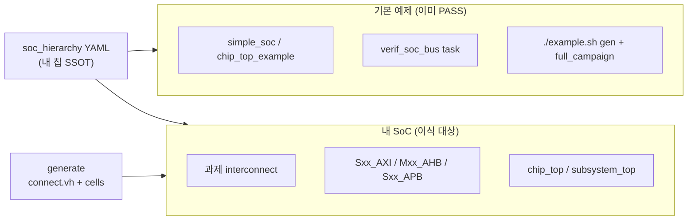

# How to integrate VerifCPU VCPUs into **your** SoC

> **이 문서의 역할** — 기본 예제(`./example.sh`, `chip_top_example`, `simple_soc`)가 PASS한 뒤, **과제 실칩 top**에 가상 CPU(SCPU) 검증 블록을 올리는 **사람용 절차 요약**.  
> **사용자 절차서 (처음 쓰는 사람):** [`USER-PROCEDURE.md`](./USER-PROCEDURE.md) — bootstrap·intake·sim·gate 순서.  
> **LLM 에이전트**는 Obsidian vault [`00-INTEGRATION-HUB.md`](../../templates/obsidian/agent/vcpu-soc-integration/00-INTEGRATION-HUB.md) · tier [`13-INTEGRATION-TIERS.md`](../../templates/obsidian/agent/vcpu-soc-integration/13-INTEGRATION-TIERS.md) 를 SSOT로 따른다.
> 신호·매크로·RTL 상세: **`~/tools/__CFA/VerifCPU/verif_cpu_verilog/howto_integrate.md`**, **`vcpu_skill.md`** (`$RTL_ROOT` = 동일 경로 · bootstrap: [`scripts/bootstrap_verifcpu_workspace.sh`](./scripts/bootstrap_verifcpu_workspace.sh)).

**대상 독자:** SoC RTL/검증 엔지니어 — 주소맵·interconnect 포트명을 알고 있으며, soc-verify-agent gate(c-compile → coi_conn → slave_rw)로 통합을 검증하려는 사람.

**기본 예제와 분리하는 이유**

| 문서 | 범위 |
|------|------|
| VerifCPU `README.md` | campaign TB 빌드·43-check 회귀 |
| `architecture_example.md` | 블록 다이어그램 |
| `howto_integrate.md` | AMBA 배선·manifest·generate **신호 수준** |
| **`howto_integrate2yourSoC.md` (이 파일)** | **내 SoC에 이식하는 단계별 체크리스트 + 검증 gate 연계** |

`./example.sh` PASS는 **펌웨어·phase·agent·icode**가 맞다는 뜻이지, **과제 배선**을 대신하지 않는다.

---

## 0. 두 세계 — 무엇이 바뀌는가



| 항목 | 기본 예제 | 내 SoC |
|------|-----------|--------|
| SoC 모델 | `simple_soc` task | 과제 `axi_interconnect` 등 |
| CPU bus | `verif_soc_bus` → task | `verif_*_master` **핀** → `Sxx_*` |
| Agent snoop | `u_soc.stxn_valid[tap]` | bus monitor → `tap_valid[tap_id]` |
| 배선 | TB/chip_top_example 내부 고정 | **manifest + `verif_soc_bus_connect.vh`** |
| 검증 | VerifCPU Makefile | + soc-verify-agent **coi_conn / slave_rw** |

---

## 1. 선행 조건 (기본 예제)

아래 **campaign 회귀**는 모든 tier에서 필수.  
**tier smoke 명령·PASS 마커 SSOT:** vault `13-INTEGRATION-TIERS.md` — intake `chip.integration_tier`에 맞게 **하나만** 실행.

```bash
# RTL_ROOT 확정 (최초 1회 — 기본 ~/tools/__CFA)
cd projects/VERIF-CPU-SOC && ./scripts/bootstrap_verifcpu_workspace.sh
export RTL_ROOT="$(python3 -c "import sys; sys.path.insert(0,'.'); from ops.intake_resolve import resolve_rtl_root; print(resolve_rtl_root(__import__('pathlib').Path('.')))")"

cd "$RTL_ROOT"
./example.sh gen
make full_campaign          # 43/43, vcd_marker 0xDEADDEAD — 항상

# tier smoke — 13-INTEGRATION-TIERS.md §S1 (integration_tier 에 맞게 하나만):
#   paste:      make soc-paste
#   yaml_multi: make gen && make soc-integration
#   scale:      make chip-top-example
```

soc-verify-agent sanity gate:

```bash
cd /path/to/soc-verify-agent/projects/VERIF-CPU-SOC
./scripts/01_sanity_VerifCPU_c-compile_and_elab.sh
```

**산출물 확인 (tier별):**

| tier | 확인할 산출물 |
|------|----------------|
| 공통 | `include/tb_full_campaign_gen.vh`, `firmware/*.hex` |
| 1 | `include/soc_cpu_bus_paste_fabric.vh` |
| 2 | `soc_integration_ports.yaml`, `include/soc_integration_example_gen.vh` |
| 3 | `verif_soc_bus_connect.vh`, `chip_top_*_gen.vh`, `chip_top_decode.vh` |

---

## 2. 내 SoC에서 수집할 정보 (slave 1개당)

과제 주소맵·interconnect diagram·SFR spec에서 **확정**한다. 미확정 시 manifest 작성 금지.

| 필드 | 질문 | 예 |
|------|------|-----|
| `name` | 슬레이브 역할 | `DMA_CH3` |
| `cpu_id` | SCPU 번호 (1..N) | `37` |
| `tap_port` | agent snoop 채널 (≠ AXI 포트 번호) | `37` |
| `bus_type` | 프로토콜 | `axi` / `ahb` / `apb` |
| `bus_port` | interconnect **RTL 포트 prefix** | `S37_AXI` |
| `addr_base` / `addr_size` | 절대 주소 구간 | `0x4A00_0000`, `0x1000` |
| `targets[]` | Phase B/C가 access할 레지스터 | `{ sym, expect, icode }` |

칩 전체:

- `CAMPAIGN_NUM_SCPU` — active + reserved 합
- master `cpu_id = 0` (tap 없음, init_done poll)
- `INIT_DONE` 레지스터 주소 (`soc_platform.h`)
- clock/reset 도메인 (버스별)

**인덱스 규칙 (혼동 금지)**

| 개념 | 규칙 |
|------|------|
| `cpu_id` | 1-based |
| generate 블록 `g_slvN` | **N = cpu_id − 1** (flat, iverilog XMR) |
| `CONNECT_SLV{cpu_id:02d}_*` | `g_slv[cpu_id-1].u_bus` |

---

## 3. 통합 절차 (8단계)

### Step 1 — 내 칩 hierarchy YAML 작성

기본 예제 파일을 **복사·편집**한다 (예제 SSOT를 직접 수정하지 말 것).

```bash
cp firmware/campaign/soc_hierarchy_example.yaml \
   firmware/campaign/soc_hierarchy_<MY_CHIP>.yaml
```

`slaves[]`에 **내 칩**의 `cpu_id`, `bus_port`, `addr_base`를 기입한다.  
예제 4-slave(SFR/SRAM/UART/DMA)는 **참고용**이며, 포트명·주소는 과제 문서와 1:1 대조.

**새 tag / deployment 폴더** — `./example.sh gen`이 **만들지 않는** MD·intake도 복사:

```bash
cd projects/VERIF-CPU-SOC/inputs/tags && ./copy_new_tag.sh <NEW_TAG>
```

`integration_notes.md`, `questions_pending.md`, `customer_soc_intake.yaml` 등 — [`12-EXAMPLE-SCAFFOLD.md`](../../templates/obsidian/agent/vcpu-soc-integration/12-EXAMPLE-SCAFFOLD.md).

soc-verify-agent 입력 등록 (선택):

```yaml
# inputs/tags/{tag}/manifest.yaml
artifacts:
  - path: deployment/soc_hierarchy_<MY_CHIP>.yaml
    kind: deployment
    rev: r1.0
    used_by: [static/coi_conn, simulation/slave_rw]
```

### Step 2 — 펌웨어 C 위치 확인 (사용자 제공)

**검증 주소가 나뉜 C/헤더는 사용자가 준비**한다. 에이전트는 경로를 **사용자에게 질문**한 뒤, 받은 C 다발을 `firmware/campaign/` **정해진 위치에 복사**하고 `campaign_slots.yaml`·`NUM_SCPU`를 맞춘다 — [`10-FIRMWARE-STAGE.md`](../../templates/obsidian/agent/vcpu-soc-integration/10-FIRMWARE-STAGE.md).

대표 경로(예제 기준): `soc_regs.h`, `common/phase_*.c`, `cpu_*/`, `icodes/*/*.c`, `campaign_slots.yaml` — 상세: VerifCPU `example_outputs.md` §10.

`soc_regs.h`의 `SFR_CTRL`, `SRAM_MARKER` 등이 **내 SFR 맵**과 일치하는지 대조. 불일치 시 icode·Phase B hint가 잘못된 주소를 친다.

과제 SFR CSV가 있으면 `inputs/tags/{tag}/sfr/`에 두고 manifest에 등록.

### Step 2b — 시뮬 환경·실행법 (사용자 작성)

**통합(S7) 직후 돌릴 smoke sim**은 사이트·EDA마다 다릅니다. 에이전트가 iverilog/Questa 등을 추측하지 않도록, intake `simulation` 블록에 **간단히** 적어 둡니다.

템플릿: [`simulation_env.template.yaml`](../../templates/obsidian/agent/vcpu-soc-integration/intake/simulation_env.template.yaml) · 가이드: [`11-SIMULATION-USER.md`](../../templates/obsidian/agent/vcpu-soc-integration/11-SIMULATION-USER.md)

| 필드 | 사용자가 적는 내용 |
|------|-------------------|
| `environment.setup` | 시뮬 도구·module·Docker·라이선스 **구하는 방법** |
| `environment.verify_cmd` | 환경 준비 확인 한 줄 |
| `run.smoke_after_integration` | **배선 직후** 실행 명령 (cwd·env 포함) |
| `pass.log_markers[]` | sim.log에서 PASS 문자열 |

`simulation.user_documented: true` 후에만 통합 직후 sim·formal gate를 진행합니다.

### Step 3 — manifest·config 재생성

```bash
cd firmware/campaign
# 슬롯 수·bus layout (내 칩 slave 수에 맞게)
make config NUM_SCPU=<N>
# 또는: ./example.sh gen --axi <n_axi> --ahb <n_ahb> --apb <n_apb>

make soc_init
make icodes
# manifest는 icodes 선행 dep로 함께 갱신됨 (별도 make manifest 불필요)
```

probe로 **SoC hierarchy 오타를 sim 전에** 잡는다:

```bash
make icodes    # icode_map.json 생성
# icode_map.json: bus_addr, tap_port 가 YAML과 일치하는지 확인
```

### Step 4 — connect VH 생성 (과제 포트명)

```bash
python3 gen_soc_bus_connect.py --yaml soc_hierarchy_<MY_CHIP>.yaml
# 또는: make bus_connect   # manifest bus_port 기준 (yaml 아님)
# 산출: include/verif_soc_bus_connect.vh
```

생성된 `CONNECT_SLVxx_*` 매크로의 `Sxx_*` prefix가 **과제 top 포트명**과 문자열 일치해야 한다.  
상세 매크로 형식 → `$RTL_ROOT/howto_integrate.md` §5.3.

### Step 5 — 과제 top 배선 (tier별)

| Tier | 방법 | SSOT |
|------|------|------|
| **1 paste** | `g_slv0` 직결 복사 | `integration_paste.md` · `soc_cpu_bus_paste_fabric.vh` |
| **2 yaml_multi** | `g_slvN` 직결 복사 | `soc_integration_ports.yaml` · `soc_integration_example_gen.vh` |
| **3 scale** | CONNECT + generate | `verif_soc_bus_connect.vh` · `chip_top_example.v` |

**Tier 3 (CONNECT) 상세:**

1. `include/verif_soc_bus_connect.vh` include
2. `chip_top_example` 패턴으로 `g_slv{cpu_id-1}` generate
3. `verif_agent_slave` — `TAP_PORT` = manifest `tap_port`
4. orchestrator broadcast · snoop 4신호 → `tap_valid[tap_id]`

Agent/LLM → vault `13-INTEGRATION-TIERS.md` · `$RTL_ROOT/vcpu_skill.md`.

### Step 6 — 통합 직후 smoke 시뮬 (S9, 필수)

**배선(Step 5) 직후**, intake `simulation.run.smoke_after_integration`을 실행합니다.  
PASS(`pass.log_markers`) 확인 전에는 아래 formal gate(Step 7–8)로 가지 않습니다.

```bash
# 예 (VerifCPU iverilog — 첫 통합 smoke, intake에 명시)
cd "$RTL_ROOT"
make soc-paste 2>&1 | tee sim_smoke.log
# log: soc_cpu_bus_paste: PASS · Checklist: 4 passed / 0 failed
# scale 검증: make chip-top-example (16 checks)
```

Questa·사내 run 스크립트·고객 top injection은 **사용자가 intake에 적은 명령**을 따릅니다.

### Step 7 — 정적 연결 검증 (coi_conn gate)

배선 후 **구조적 COI**로 orch ↔ periphery ↔ agent 경로를 확인한다.

```bash
# soc-verify-agent
./scripts/02_static_COI_connectivity_chip_top.sh
```

- filelist/top: **내 chip top** (예: `chip_top` not `chip_top_example` — 과제에 맞게 갱신)
- `coi_conn_checks.json`: 2~3 endpoint, `expected_connected` 명시
- instance 경로는 `hier-walk … -o instances.tsv`로 재확인

명세: `verification/static/coi_conn/coi_conn.md`

### Step 8 — 시뮬 3-tier (slave_rw gate)

c-compile fw **재빌드 없이** tier별 sim:

| tier | 목적 | 참고 타깃 |
|------|------|-----------|
| sim_single | single-beat R/W | `vvp sim_build/tb_soc_dut.vvp` |
| sim_burst | AMBA bridge smoke | `vvp sim_build/tb_soc_bus_all.vvp` |
| sim_cpu_sync | vsync + parallel bus | `vvp sim_build/tb_full_campaign.vvp` |

```bash
./scripts/03_simulation_slave_R_W_single_burst_cpu_sync.sh
```

내 SoC top으로 TB를 바꾼 경우 ops crystallize가 **동일 원칙·다른 top/filelist**를 사용한다.  
명세: `verification/simulation/slave_rw/slave_rw.md`

### Step 9 — 회귀 고정

전체 gate PASS 후:

```bash
./scripts/run_VERIF-CPU-SOC_verification_sequence.sh
```

`inputs/tags/{tag}/manifest.yaml`에 deployment rev·SFR rev를 기록하고 `reports/index.yaml` tag를 맞춘다.

---

## 4. Phase 실행 순서 (campaign과 동일 — 내 top에서도)

1. **Phase A** — SoC init (`soc_init_seq` 17-step)
2. **VCPU Phase A** — 각 CPU `OFF_A` FW
3. **Agent Phase A** — init txn snoop
4. **init_done poll** — Master @ `INIT_DONE_ADDR`
5. **Phase B** — manifest hint → bus read → agent 수집
6. **Phase C** — icode RV32 exec + multi-slot verify
7. **VCD** — `0xDEADDEAD`

내 `INIT_DONE` 주소가 다르면 `soc_platform.h` 수정 → `make soc_init`.

---

## 5. 통합 전 체크리스트

intake `chip.integration_tier`에 맞는 섹션만 적용.

### 공통

- [ ] `make full_campaign` 43/43 PASS
- [ ] `addr_base`..`addr_base+size`가 과제 주소맵과 일치
- [ ] `tap_port` ↔ monitor 채널 1:1
- [ ] `icode_map.json`의 `bus_addr` / `tap_port`가 manifest와 일치 (probe)
- [ ] `cpu_id` 중복 없음, master는 `0`만
- [ ] intake `simulation` 작성 + **통합 직후 smoke sim PASS** (Step 6)
- [ ] coi_conn 2~3 check PASS (의도적 disconnect 포함)
- [ ] slave_rw 3-tier log 마커 PASS
- [ ] soc-verify-agent `verification_sequence` 전체 PASS

### Tier 1 — paste

- [ ] tier 1 smoke PASS — `13-INTEGRATION-TIERS.md` §tier-1
- [ ] `soc_cpu_bus_paste_fabric.vh` → 과제 top 직결 (포트 · bus_type · base)
- [ ] CONNECT 매크로 **불필요**

### Tier 2 — yaml_multi

- [ ] `soc_integration_ports.yaml` ↔ `campaign_slots.yaml` role sync
- [ ] `make gen` → `soc_integration_example_gen.vh` 존재
- [ ] tier 2 smoke PASS — `13-INTEGRATION-TIERS.md` §tier-2
- [ ] `g_slvN` 블록 → 과제 top 직결

### Tier 3 — scale

- [ ] tier 3 smoke PASS — `13-INTEGRATION-TIERS.md` §tier-3 (또는 동등)
- [ ] `soc_hierarchy_<MY_CHIP>.yaml` — `bus_port`가 과제 RTL과 **문자열 일치**
- [ ] `verif_soc_bus_connect.vh` 재생성 후 과제 top include 갱신
- [ ] `g_slv[cpu_id-1].u_bus` + `verif_chip_soc_bus_*.vh` (수동 adapter 없음)

---

## 6. 자주 하는 실수

| 증상 | 원인 | 조치 |
|------|------|------|
| compile OK, sim X | `S37_AXI` vs `S37_AXI0` 오타 | manifest `bus_port` ↔ RTL 포트 재대조 |
| icode probe FAIL | `soc_regs.h` 주소 불일치 | SFR 맵 갱신 후 `make icodes` |
| coi_conn endpoint not found | gen VH 미반영 / wrong top | `./example.sh gen` 선행, instances.tsv |
| cpu_sync tier FAIL | sim 중 C 재빌드 | ops는 vvp만 — `make -C firmware` 금지 |
| chip-top 16-check OK, 내 top FAIL | 예제 yaml 그대로 사용 | **내 yaml** + 내 top으로 Step 1~5 재수행 |

---

## 7. 관련 파일 맵

| 경로 | 역할 |
|------|------|
| `firmware/campaign/soc_hierarchy_example.yaml` | **예제** (복사 원본) |
| `firmware/campaign/soc_hierarchy_<MY_CHIP>.yaml` | **내 칩 SSOT** |
| `include/verif_soc_bus_connect.vh` | 생성 — CONNECT 매크로 |
| `include/chip_top_*_gen.vh` | 생성 — cells + agents |
| `firmware/campaign/include/soc_regs.h` | slave 주소 |
| VerifCPU `howto_integrate.md` | 신호·매크로·N-slave 확장 |
| VerifCPU `vcpu_skill.md` | LLM/agent 통합 계약 |
| `verification/static/coi_conn/coi_conn.md` | 정적 COI gate |
| `verification/simulation/slave_rw/slave_rw.md` | 3-tier sim gate |
| `scripts/verification_sequence.yaml` | 검증 순서 SSOT |

---

## 8. 요약

1. **기본 예제 PASS** ≠ **내 SoC 통합 완료**.
2. **내 칩 전용** `soc_hierarchy_*.yaml` + generate + 과제 top 배선이 핵심.
3. **신호 상세**는 `howto_integrate.md`, **절차·검증 연계**는 이 문서.
4. **통합 직후 사용자 smoke sim** → 그다음 soc-verify-agent **coi_conn → slave_rw** gate.

질문·주소맵 리뷰 산출물은 `inputs/tags/{tag}/deployment/`에 두고 `manifest.yaml`에 등록한다.