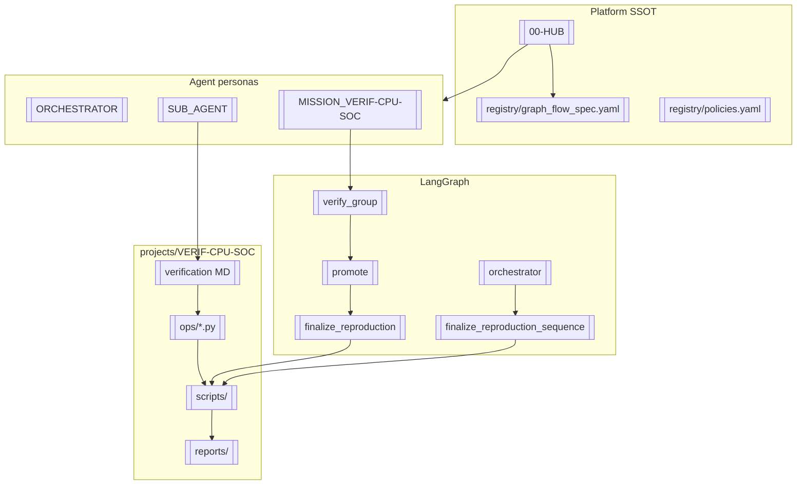

# soc-verify-agent — Obsidian Hub

> Vault 위치: `soc-verify-agent/templates/obsidian/` → 사용자 vault `05-Agents/`  
> 태그: `#platform` `#langgraph` `#compiled-ai` `#project/VERIF-CPU-SOC`

---

## 시작점 (역할별)

| 역할 | 읽을 노트 |
|------|-----------|
| LLM Sub-agent | [[SUB_AGENT]] → [[01-GRAPH-FLOW#verify_group]] → gate [[CHECK]] |
| **VCPU→SoC 통합 에이전트** | [[agent/vcpu-soc-integration/00-INTEGRATION-HUB]] |
| Orchestrator LLM | [[ORCHESTRATOR]] → [[01-GRAPH-FLOW#orchestrator]] |
| 전체 미션 (VERIF) | [[MISSION_VERIF-CPU-SOC]] |
| 아키텍처 | [[02-LAYERS]] |
| MD→Python 루프 | [[03-COMPILED-AI-LOOP]] |
| **Runner·parity 계약** | [[07-TRUST-CONTRACT]] · **루프 다이어그램** [[08-RUNNER-LOOP]] |
| **env/bridge 자율개선** | [[09-BRIDGE-LOOP]] |
| **메타 그래프·KPI** | [[10-META-GRAPH]] |
| **LangGraph 전체 순서도** | [[11-LANGGRAPH-SUMMARY]] |
| 산출물 연결 | [[04-ARTIFACT-GRAPH]] |
| 부족한 점·보완 | [[05-GAPS-REMEDIATION]] |
| 산업 사례 | [[06-INDUSTRY-PATTERNS]] |

---

## 그래프 뷰 (MOC)



---

## 위키 링크 규칙

| 접두 | 의미 | 예 |
|------|------|-----|
| `[[NN-...]]` | 플랫폼 개념 노트 | [[03-COMPILED-AI-LOOP]] |
| `[[ORCHESTRATOR]]` | 에이전트 페르소나 | |
| `[[gate/sanity/c-compile]]` | gate 노트 (프로젝트별) | [[projects/VERIF-CPU-SOC#gate-1]] |
| `[[artifact/verdict]]` | 산출물 계약 | [[04-ARTIFACT-GRAPH#verdict]] |
| `#project/{id}` | 프로젝트 태그 | #project/VERIF-CPU-SOC |
| `#group/{stage}/{group}` | gate 태그 | #group/static/coi_conn |

파일 시스템 경로는 백틱: `projects/VERIF-CPU-SOC/ops/static/coi_conn.py`

---

## E2E 한 줄 경로

```
[[discovered]] → [[intake]] → [[tag_watch]] → [[verify_group]] → [[promote]] → [[crystallize]]
  → [[finalize_reproduction]] → [[finalize_reproduction_sequence]] → [[reports]] → [[patterns]]
```

상세: [[03-COMPILED-AI-LOOP]] · 갭: [[05-GAPS-REMEDIATION]]

---

## 관련 코드 (Obsidian 밖 — 읽기 금지 대상은 Sub-agent)

| 모듈 | 노트 |
|------|------|
| `src/soc_verify/graphs/verify_group.py` | [[01-GRAPH-FLOW#verify_group]] |
| `src/soc_verify/graphs/orchestrator.py` | [[01-GRAPH-FLOW#orchestrator]] |
| `src/soc_verify/crystallize.py` | [[03-COMPILED-AI-LOOP#crystallize]] |
| `src/soc_verify/trust_eval.py` | [[03-COMPILED-AI-LOOP#trust-handoff]] |
| `src/soc_verify/reproduction_scripts.py` | [[04-ARTIFACT-GRAPH#reproduction]] |