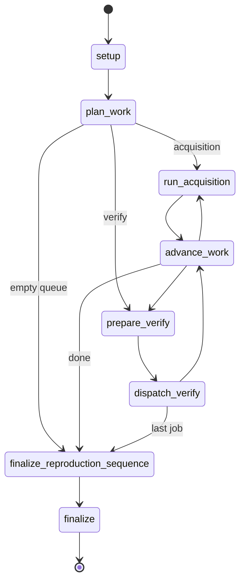

# LangGraph Flow — 노드·엣지·산출물

SSOT: `registry/graph_flow_spec.yaml`  
태그: `#langgraph` `#platform`

상위: [[00-HUB]] · 보완: [[05-GAPS-REMEDIATION]] · 산업: [[06-INDUSTRY-PATTERNS#unified-cockpit]]

---

## orchestrator

진입: `setup` · 종료: `finalize`  
페르소나: [[ORCHESTRATOR]]

| 노드 | actor | 다음 | 쓰는 산출물 | 읽는 MD/설정 |
|------|-------|------|-------------|--------------|
| [[node/setup]] | platform | plan_work | `runs/orchestrator/{id}/` | — |
| [[node/plan_work]] | platform | acquisition / verify / [[node/finalize_reproduction_sequence]] | `work_queue` | `state.yaml` → `verification_groups_due` |
| [[node/run_acquisition]] | platform | advance_work | acquisition log | `config.json` |
| [[node/prepare_verify]] | platform | dispatch / advance | `group_context` | gate [[CHECK]] |
| [[node/dispatch_verify]] | platform | advance / [[node/finalize_reproduction_sequence]] | — | → **verify_group** 세션 |
| [[node/advance_work]] | platform | loop | `work_index++` | — |
| **[[node/finalize_reproduction_sequence]]** | llm_assisted | finalize | `run_{PID}_verification_sequence.sh`, `reproduction_sequence_finalize.json` | [[templates/scripts/README]] |
| [[node/finalize]] | platform | END | `workflow.json` | — |



**연결:** `dispatch_verify` ─embeds→ [[01-GRAPH-FLOW#verify_group]]

---

## verify_group

진입: `setup` · 종료: `finalize`  
페르소나: [[SUB_AGENT]]

| 노드 | actor | 조건 | 쓰는 산출물 | 읽는 MD |
|------|-------|------|-------------|---------|
| [[node/load_context]] | platform | — | `md_only_prompt.md` | [[CHECK]], [[RESPOND]], [[MILESTONE]] |
| [[node/select_runner]] | platform | trust+C | `runner: python\|llm` | `trust/registry.yaml`, [[03-COMPILED-AI-LOOP#trust-handoff]] |
| [[node/run_gate]] | llm_when_runner_llm | — | `verdict_{group}.json`, `sub_stop.json` | [[CHECK]] only |
| [[node/evaluate]] | platform | — | `completeness_decision.json` | [[registry/policies.yaml]] |
| **[[node/parity_check]]** | platform | PASS | `parity_report.json`, `llm_reference_verdict.json` | [[08-RUNNER-LOOP]] |
| **[[node/run_codegen]]** | llm_assisted | parity FAIL | `ops/{stage}/{group}.py`, `codegen_prompt.json` | [[08-RUNNER-LOOP]] |
| [[node/promote]] | llm_assisted | parity.ok | `promote_decision.md`, `crystallize_proposal.md` | trust_report |
| **[[node/finalize_reproduction]]** | llm_assisted | PASS | `NN_*.sh`, `verification_sequence.yaml`, `reproduction_finalize.json` | [[templates/scripts/README]] |
| [[node/finalize]] | platform | — | `questions_pending.md`, [[patterns]] | [[05-GAPS-REMEDIATION#erl]] |

```mermaid
stateDiagram-v2
  [*] --> setup --> load_context
  load_context --> select_runner: ok
  load_context --> finalize: INFO_GAP
  select_runner --> run_gate
  run_gate --> select_runner: FAIL
  run_gate --> evaluate: PASS
  run_gate --> finalize: INFO_GAP
  evaluate --> select_runner: open_issues
  evaluate --> parity_check: PASS
  evaluate --> finalize: FAIL end
  parity_check --> run_codegen: mismatch
  run_codegen --> parity_check
  parity_check --> promote: parity.ok
  promote --> finalize_reproduction
  finalize_reproduction --> finalize
  finalize --> [*]
```

---

## 노드 ↔ 아티팩트 매트릭스

→ 상세: [[04-ARTIFACT-GRAPH]]

| 노드 | required writes |
|------|-----------------|
| run_gate | `verdict_{group}.json` |
| promote | `promote_decision.md`, `crystallize_proposal.md` → `ops/{stage}/{group}.py` |
| finalize_reproduction | `scripts/NN_{stage}_*.sh`, `verification_sequence.yaml` |
| finalize_reproduction_sequence | `run_{PROJECT_ID}_verification_sequence.sh`, `reports/index.yaml` |

---

## Graph API (LLM 호출)

```bash
soc-verify --root . graph spec
soc-verify --root . graph start --graph verify_group --project ID --stage ST --group G
soc-verify --root . graph status --session {id}
soc-verify --root . graph tick --session {id}
```

계약: [[SUB_AGENT#Graph API]] · 마찰: [[05-GAPS-REMEDIATION#tick-split]]