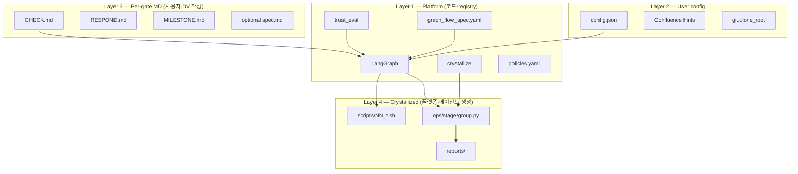

# 3-Layer Architecture — Platform / User / Verification MD

태그: `#platform` `#architecture`  
상위: [[00-HUB]]

---

## 레이어 맵

---

## 읽기 권한 (LLM)

| 레이어 | Sub-agent | Orchestrator LLM |
|--------|-----------|------------------|
| L3 CHECK/RESPOND | ✅ 판정용 | ❌ |
| graph_flow_spec | ✅ 플로우용 | ✅ |
| policies.yaml | ❌ | ❌ |
| graphs/*.py | ❌ | ❌ |
| ops/*.py | 실행만 (python runner) | 관찰만 |

→ [[SUB_AGENT#Read]] · [[ORCHESTRATOR#Company LLM contract]]

---

## 파일 소유권

| 경로 | 작성자 | 소비자 |
|------|--------|--------|
| `verification/**` | DV / 사용자 | LLM `md_only` |
| `ops/**` | crystallize | `select_runner=python` |
| `scripts/**` | finalize_reproduction | 사용자 재현 |
| `trust/registry.yaml` | registry_writer | select_runner |
| `reports/**` | generate_reports | DV / 릴리스 |
| `inputs/tags/**` | 사용자 주간 입력 | ops override |

연결: [[04-ARTIFACT-GRAPH]]