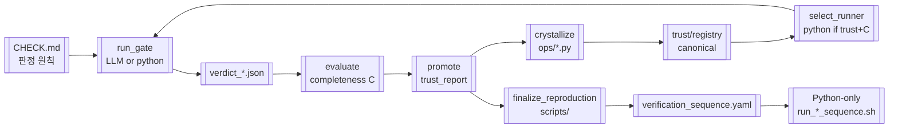

# Compiled AI Loop — MD-first → Python-only

태그: `#compiled-ai` `#self-improve`  
상위: [[00-HUB]] · 논문: [[06-INDUSTRY-PATTERNS#compiled-ai]] · 갭: [[05-GAPS-REMEDIATION]]

---

## 루프 다이어그램



---

## 단계별 SSOT

| 단계 | MD 노트 | 코드/파일 | 산업 유사 패턴 |
|------|---------|-----------|----------------|
| 명세 | [[CHECK]], spec.md | `verification/` | Synopsys Verification Plan |
| 실행 | [[RESPOND]] | `ops/{stage}/{group}.py` | Compiled AI artifact |
| 판정 | CHECK 원칙 | `verdict_*.json` | VC ExecMan pass/fail |
| 신뢰 | — | `trust/registry.yaml` | VSO.ai feedback loop |
| 승격 | promote_decision | `registry_writer` | 4-stage validation (목표) |
| 재현 | [[templates/scripts/README]] | `scripts/NN_*.sh` | Regression runner scripts |
| 개선 | [[patterns]] | `projects/{id}/patterns/` | ERL heuristic |

---

## trust-handoff

**의도 SSOT:** [[07-TRUST-CONTRACT]] — tool 먼저 → codegen → **parity 동일** → canonical python.

요약:

```
ops 없음 / parity FAIL  →  llm_tools (검증 진행) → llm_codegen (ops 작성)
parity OK               →  python_canonical (이후 LLM 없음)
INFO_GAP                →  유일한 hard stop
```

레거시 코드 (`registry/policies.yaml`): `trust >= tau_run` AND `C >= 0.75` → `python`.  
→ **parity gate 통과를 trust 승격의 필수 조건으로 올려야** 의도와 일치.

**현재 갭:** VERIF `trust/registry.yaml` draft·0.0; **parity_report 없음**.  
**보완:** [[05-GAPS-REMEDIATION#parity-loop]] · [[05-GAPS-REMEDIATION#trust-bootstrap]]

---

## crystallize

입력: `runs/{id}/crystallize_proposal.md` (fenced python)  
출력: `projects/{id}/ops/{stage}/{group}.py`  
코드: `src/soc_verify/crystallize.py`

**갭:** 4-stage validation 없음 (security/syntax/exec/accuracy).  
**목표:** [[05-GAPS-REMEDIATION#crystallize-pipeline]] · [[06-INDUSTRY-PATTERNS#compiled-ai]]

---

## Python-only 종료 조건

- [ ] 모든 due gate `trust.status: canonical`
- [ ] `trust/golden/{tag}/` gate별 fixture
- [ ] `scripts/run_{PROJECT}_verification_sequence.sh` PASS
- [ ] `llm_invocations` / gate → 0 수렴 (메트릭)

프로젝트 예: [[projects/VERIF-CPU-SOC]]