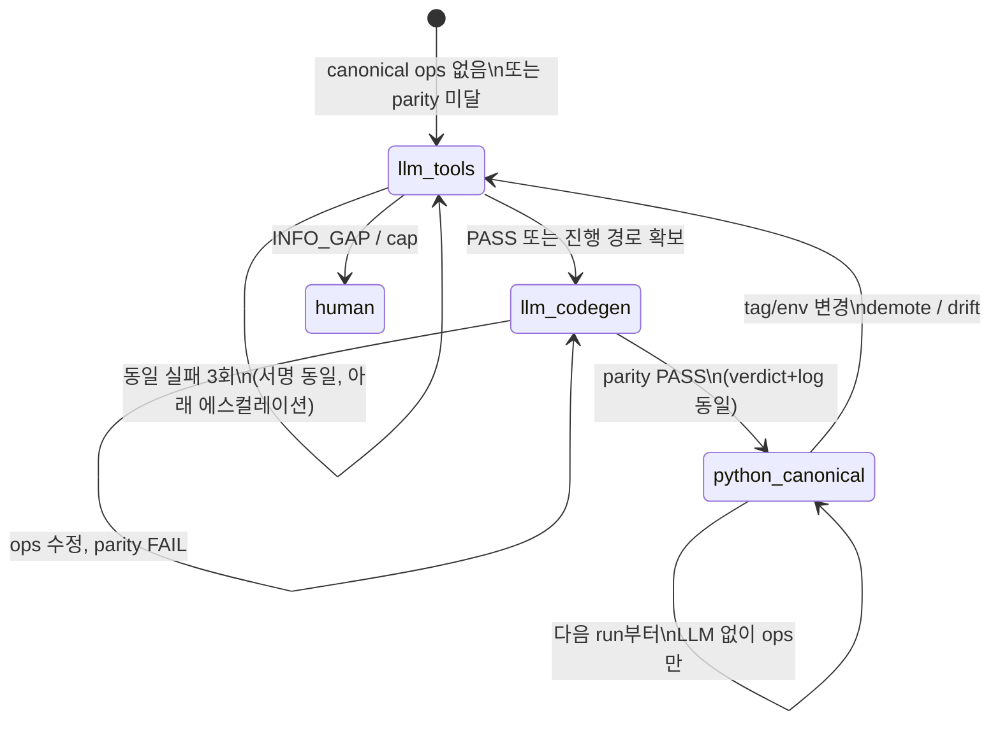

# Trust & Runner Contract — LLM tool → Python parity → canonical

태그: `#platform` `#compiled-ai` `#trust`  
상위: [[00-HUB]] · 루프: [[03-COMPILED-AI-LOOP]] · **다이어그램**: [[08-RUNNER-LOOP]] · 갭: [[05-GAPS-REMEDIATION#parity-loop]]

**핵심 원칙:** LLM이 검증을 **진행시켰다면** 그 경로는 Python으로 옮길 수 있다.  
Python이 다르면 “방법이 틀림”이 아니라 **ops 코딩 버그**다. parity가 맞을 때까지 ops를 고친다.

---

## Runner 상태机 (의도 SSOT)



---

## 단계 정의

### 1. `llm_tools` — 검증을 **먼저** 진행 (기본, ops 없을 때)

| 항목 | 내용 |
|------|------|
| **언제** | `ops/{stage}/{group}.py` 없음, draft, 또는 **마지막 parity FAIL** |
| **LLM 행동** | CHECK.md 기준으로 **직접 tool calling** (compile, sim, scan-inst, log 읽기) |
| **산출물** | `verdict_{group}.json`, 실행 log, (선택) `llm_run_trace.json` |
| **목적** | “되는 길”을 **먼저** 찾는다. 검증 큐는 **멈추지 않는다** |

→ MD는 **판정 기준**만. 실행은 tool.

### 2. `llm_codegen` — LLM이 찾은 길을 **Python으로 옮김**

| 항목 | 내용 |
|------|------|
| **언제** | `llm_tools`로 PASS(또는 재현 가능한 성공 경로) **이후 같은 run 또는 다음 fix round** |
| **LLM 행동** | `ops/{stage}/{group}.py` (또는 `_*.py` helper) **작성·수정** |
| **금지** | parity 전에 canonical 승격만 하고 끝내기 |

### 3. Parity gate — **동일할 때까지** ops 수정 (필수)

| 비교 대상 | |
|-----------|--|
| A | LLM tool run: `verdict_*.json`, 핵심 log, tier/connectivity 필드 |
| B | Python ops run: **동일** `--project`, `--run-dir`(또는 golden run-dir) |

**규칙:**

- A와 B가 **동일** → `parity.ok: true` → 4단계로
- A는 PASS인데 B가 FAIL → **ops 버그**. LLM/에이전트는 ops만 수정 (다시 `llm_codegen`)
- “Python으로는 불가능”이라고 결론 내리지 않음 (LLM이 이미 증명했으므로)

**parity에 넣을 것 (gate별 최소):**

| gate | 필드 |
|------|------|
| 공통 | `status`, `log_scan.ok`, evidence hash |
| slave_rw | `tiers.*.ok`, log 마커 |
| coi_conn | `connectivity` map |
| c-compile | `artifacts.firmware`, compile log exit |

산출물: `runs/{id}/parity_report.json`

### 4. `python_canonical` — 다음부터 **그 코드만**

| 항목 | 내용 |
|------|------|
| **조건** | `parity.ok` + (권장) 연속 2~3회 PASS + golden |
| **행동** | `select_runner` → `python`; `trust/registry` → `canonical` |
| **런타임** | **LLM/tool 호출 없음** (Compiled AI 실행 단계) |

---

## 기존 플랫폼과의 차이

| | 현재 soc-verify | 이 계약 (의도) |
|--|-----------------|----------------|
| ops 없을 때 | md_only LLM sub-agent | **`llm_tools` 먼저** |
| PASS 후 | promote → crystallize (parity 없음) | **parity 맞출 때까지 ops 수정** |
| Python FAIL | trust↓, LLM 재시도 | **ops 버그로 간주**, LLM 경로와 diff |
| 3회 동일 실패 | `llm_full` (md) | `llm_tools` **유지·강화** (이미 tool 단계) |

구현 갭: [[05-GAPS-REMEDIATION#parity-loop]] · [[05-GAPS-REMEDIATION#tick-split]]

---

## loop_guard (3회 동일 실패)

의도와 정합:

- `fix_round` 1~2: `llm_tools` 또는 `llm_codegen` (경로 탐색 / ops 수정)
- **동일 signature 3회**: 무한 루프 방지 → `questions_pending` + **round cap** (`auto_pass` 금지, 기존 정책 유지)
- **auto_pass 금지** — LLM이 PASS 찍어도 `verdict_*.json` + parity 없으면 canonical 불가

---

## 논문·산업과의 대응

| 외부 패턴 | 이 계약의 어디 |
|-----------|----------------|
| **CodeAct** — 액션=코드 | `llm_codegen` |
| **ReVeal** — tool feedback 매 turn | `llm_tools` |
| **Compiled AI** — validate 후 freeze | **parity PASS 후** `python_canonical` |
| **AlphaCodium** — test until pass | parity loop |
| **Voyager skill** | canonical `ops/*.py` |
| **TT-SI** | parity FAIL log → `trust/golden/` [[08-GOLDEN-LIBRARY]] (예정) |

---

## 한 run 타임라인 (gate 하나)

```
1. llm_tools     → compile/sim … → verdict_PASS (또는 FAIL→RESPOND→재시도)
2. llm_codegen   → ops/*.py 초안
3. python trial  → subprocess ops
4. parity diff   → FAIL면 2로 (ops만 수정)
5. parity OK     → promote/canonical, reproduction scripts
6. 다음 run      → runner=python only
```

**검증은 1에서 멈추지 않는다.** 2~4는 PASS 이후(또는 병렬 fix round)에 진행 가능.

---

## Obsidian 링크

- 산출물: [[04-ARTIFACT-GRAPH#verdict]] · `parity_report.json` · `llm_reference_verdict.json`
- 그래프 노드: [[01-GRAPH-FLOW#verify_group]] — `parity_check` / `run_codegen` (코드 edge 강제, [[08-RUNNER-LOOP]])
- 프로젝트 예: [[projects/VERIF-CPU-SOC]] (현재 ops는 수동 작성 → **parity 재검증** 필요)

---

## LLM 지시 한 줄

> canonical ops가 없거나 parity 미달이면 **먼저 tool calling으로 CHECK 기준 검증을 PASS**시키고, 그 run과 **동일 verdict/log가 나올 때까지** `ops/{stage}/{group}.py`만 수정한 뒤 canonical로 승격하라. Python만 FAIL이면 ops 버그다.