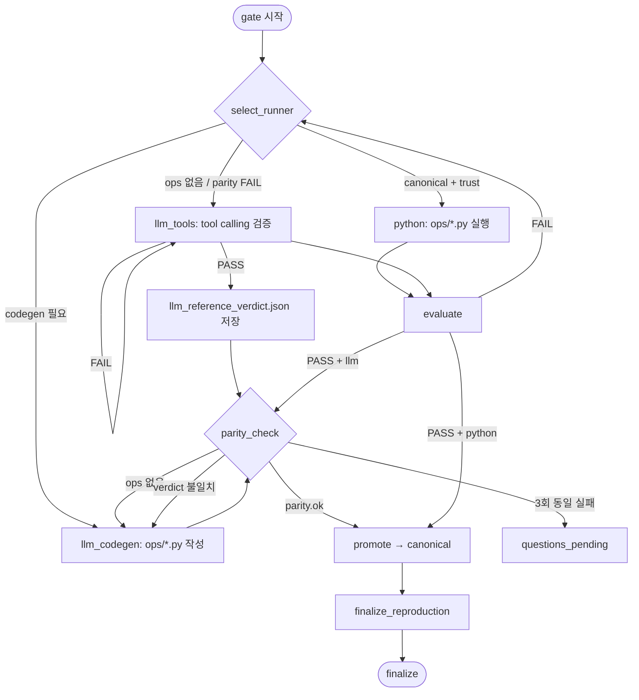
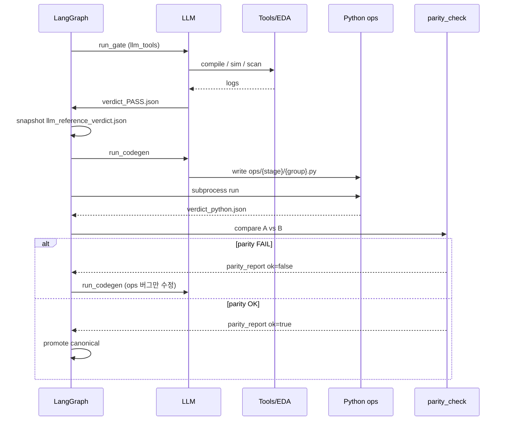

# Runner Loop — LLM 필수 준수 다이어그램

태그: `#platform` `#mandatory` `#llm-read-first`  
계약: [[07-TRUST-CONTRACT]] · 그래프: [[01-GRAPH-FLOW]] · 강제: `registry/policies.yaml` → `runner_contract`

> **LLM은 이 노트를 graph_step.json 과 함께 읽는다. 아래 순서를 건너뛰면 graph가 advance 하지 않는다.**

---

## 1. 전체 루프 (한 장)



---

## 2. 시퀀스 (gate 1회)



---

## 3. 결정 표 (LLM용)

| 조건 | MUST do | MUST NOT |
|------|---------|----------|
| `ops/*.py` 없음 | **llm_tools**로 PASS 먼저 | md만 보고 PASS 선언 |
| llm_tools PASS | `llm_reference` 스냅샷 후 **codegen** | 바로 promote |
| python ≠ llm verdict | **ops만** 수정 (codegen) | "Python 불가" 결론 |
| `parity_report.ok` | promote 허용 | canonical 승격 |
| `parity_report` 없음 | promote **차단** (코드) | — |
| 동일 실패 3회 | `questions_pending` | auto_pass |
| canonical + trust | **python only** | tool 호출 |

---

## 4. 산출물 체크리스트 (노드별)

| 노드 | required files |
|------|----------------|
| `run_gate` (llm_tools) | `verdict_{group}.json`, `llm_run_trace.json` (권장) |
| `run_codegen` | `ops/{stage}/{group}.py` |
| `parity_check` | `llm_reference_verdict.json`, `parity_report.json` |
| `promote` | `parity_report.json` **ok:true**, `promote_decision.md` |
| `finalize_reproduction` | `scripts/NN_*.sh`, `reproduction_finalize.json` |

---

## 5. ASCII (터미널/약한 뷰어용)

```
┌─────────────┐
│ select_runner│
└──────┬──────┘
       │
   ┌───┴───┐
   │canonical?──yes──► python run ──► evaluate ──► promote
   └───┬───┘
      no
       ▼
  llm_tools ──PASS──► llm_reference_verdict.json
       │                      │
      FAIL                     ▼
       └──► retry      parity_check ◄── run_codegen
                              │
                    ok? ──yes──► promote ──► reproduction
                      │
                     no
                      └──► run_codegen (ops bug fix only)
```

---

## 6. 논문·산업 — “반드시 그렇게” 만든 방법

| 출처 | 강제 메커니즘 | 우리 대응 |
|------|--------------|-----------|
| **Compiled AI** | 4-stage validator; fail 시 **deploy 차단** | `parity_check` platform node + `promote` 차단 |
| **AlphaCodium** | 단계 고정 파이프라인; test fail 시 **다음 단계 불가** | LangGraph edge: evaluate→parity→promote |
| **LangGraph / State machine** | **코드가 edge**; LLM이 skip 불가 | `verify_group.py` conditional edges |
| **CodeAct** | 액션=실행 코드; 환경이 **실행 결과** 반환 | `llm_tools` + `run_codegen` |
| **ReVeal** | 매 turn **tool + test** 필수 | CHECK + tool calling |
| **DSPy** | `compile()` 전까지 **runtime pipeline 없음** | canonical 전 python-only |
| **MetaGPT SOP** | 역할·순서 **문서 고정** | graph_flow_spec + 이 MD |
| **VC ExecMan** | plan↔result **DB 연동**; 수동 skip 어려움 | `parity_report` + registry_writer |
| **Synopsys bounded agent** | ≤N step 후 human (실무) | `loop_guard` threshold=3 |

**공통:** 프롬프트만이 아니라 **상태기계 + 게이트 함수 + artifact 검사**로 강제.

---

## 7. 코드 강제 지점 (SSOT)

| 레이어 | 파일 | 강제 내용 |
|--------|------|-----------|
| 정책 | `registry/policies.yaml` | `runner_contract` + `node_contract` |
| 노드 계약 | `registry/node_contract.yaml` | `requires_exit`, `allowed_tools`, `allowed_write_globs` |
| 세션 게이트 | `graph_session.py` | LLM 노드: exit artifact 없으면 `tick` **blocked** |
| 도구 샌드박스 | `tool_sandbox.py` | `POST .../sandbox` — 현재 노드 tool/write만 허용 |
| 그래프 명세 | `registry/graph_flow_spec.yaml` | `parity_check`, `run_codegen` 노드 |
| 라우팅 | `graphs/verify_group.py` | evaluate→parity; parity ok→promote only |
| 승격 | `registry_writer.py` | `parity_report.ok` 없으면 canonical 거부 |
| LLM 계약 | `graph_step.json` | `runner_loop: templates/obsidian/08-RUNNER-LOOP.md` |
| 프롬프트 | `templates/llm/system_*.txt` | parity + sandbox 규칙 |

---

## 8. LLM 한 줄 (복사)

```
ops 없으면 llm_tools로 PASS → llm_reference_verdict.json → ops 작성 → parity_check 동일할 때까지 ops만 수정 → parity.ok 후에만 promote. 건너뛰기 금지.
```

→ 상세: [[07-TRUST-CONTRACT]]