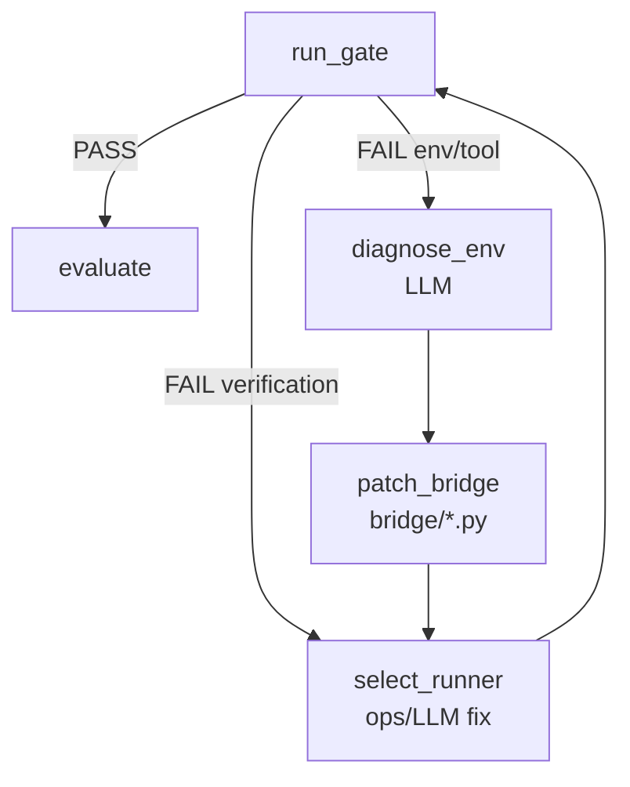

# Bridge Loop — env/tool 자율 개선

태그: `#platform` `#self-improve` `#bridge`  
상위: [[08-RUNNER-LOOP]] · 검증 ops: [[07-TRUST-CONTRACT]]

> **검증 FAIL**과 **환경/실행 오류**는 다른 루프다.

---

## Flowchart

---

## 레이어 분리

| 레이어 | 경로 | 고칠 때 |
|--------|------|---------|
| **검증** | `ops/{stage}/{group}.py` | CHECK FAIL, parity mismatch |
| **인프라** | `bridge/{stage}/{group}.py`, `meta/environment_profile.yaml` | env/tool 오류 |

---

## error_kind 라우팅 (`verify_group.py`)

| error_kind | 다음 노드 |
|------------|-----------|
| `env`, `tool` | `diagnose_env` → `patch_bridge` → `select_runner` |
| `verification`, `llm` | `select_runner` |
| `info` | `finalize` (hard stop) |

---

## 산출물

| 노드 | 파일 |
|------|------|
| diagnose_env | `env_diagnosis.md`, `bridge_patch_proposal.md` |
| patch_bridge | `bridge/{stage}/{group}.py`, `patterns/bridge_*.md` |

---

## 가드레일

- `bridge_loop.max_bridge_rounds` (`registry/policies.yaml`)
- `loop_guard` 동일 signature 3회 → stalemate
- bridge 패치는 **verdict 의미 변경 금지** — ops parity는 별도 유지