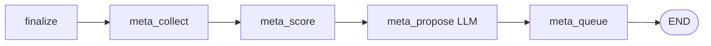

# Meta-Graph — controlled self-improvement

태그: `#platform` `#meta-graph` `#self-improve`  
상위: [[08-RUNNER-LOOP]] · KPI: `projects/{id}/improvement/history.yaml`

> Runtime LangGraph는 고정. **메타 단계**에서 LLM이 *무엇을* *어느 레이어*에서 바꿀지 구조화·제안.

---

## Flow (verify_group tail)

---

## 레이어별 수정 권한

| layer | target | auto_apply |
|-------|--------|------------|
| md | `verification/*/*.md` | ❌ queue |
| ops | `ops/*/*.py` | ❌ + parity 필요 |
| bridge | `bridge/*/*.py` | ❌ queue |
| graph_spec | `graph_flow_spec.yaml` | ❌ human |
| node_contract | `node_contract.yaml` | ❌ human |
| **graph_source** | `graphs/*.py` | ❌ **never auto** |

SSOT: `registry/meta_graph_spec.yaml`

---

## KPI (매 run)

| artifact | 내용 |
|----------|------|
| `improvement_signal.json` | run 관측값 |
| `improvement_snapshot.json` | `improvement_index`, delta vs prev/baseline |
| `projects/{id}/improvement/history.yaml` | 시계열 |

`improvement_index` ↑ → 개선 추세 · LLM은 proposal에 `expected_kpi_delta` 명시