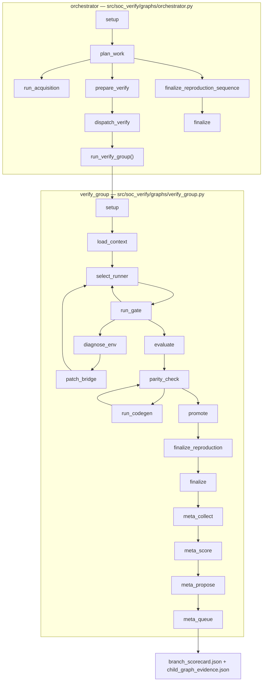
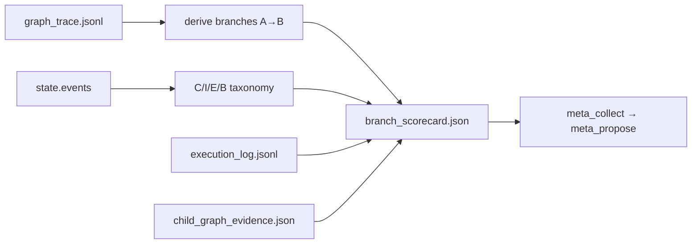
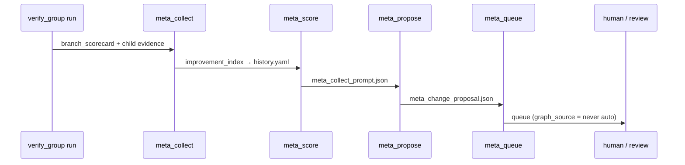

# LangGraph Summary — 런타임·분기·평가표·Child Graph

태그: `#langgraph` `#meta-graph` `#scorecard` `#child-graph` `#paper-grade`  
상위: [[00-HUB]] · SSOT: `registry/graph_flow_spec.yaml` · Child: `registry/child_graph_spec.yaml`  
평가표: `registry/branch_scorecard_spec.yaml` · 메타: [[10-META-GRAPH]]

> **목적:** LLM이 LangGraph를 개선할 때 참조하는 단일 순서도.  
> 각 노드는 코드 경로·상태·분기 평가표·child graph 증거 게이트와 연결된다.

---

## 1. 전체 구조

| Graph | State type | Builder | Run entry |
|-------|------------|---------|-----------|
| orchestrator | `OrchestratorState` · `graphs/orchestrator_state.py` | `build_orchestrator_graph()` | `run_orchestrator()` |
| verify_group | `VerifyGroupState` · `graphs/state.py` | `build_verify_group_graph()` | `run_verify_group()` |
| promote child | `PromoteChildState` · `graphs/child_subgraphs.py` | `build_promote_child_graph()` | reference subgraph |
| runner_loop child | `RunnerLoopChildState` · `graphs/child_subgraphs.py` | `build_runner_loop_child_graph()` | reference subgraph |

---

## 2. verify_group 분기별 평가표 (Branch Scorecard)

**모듈:** `src/soc_verify/branch_scorecard.py`  
**산출물:** `runs/{run_id}/branch_scorecard.json` · `projects/{id}/scorecards/history.yaml` · `scorecards/weekly_retries.yaml`

각 **conditional edge** (`graph_trace.jsonl`에서 `A→B`)마다:

| 필드 | 설명 | 소스 |
|------|------|------|
| `trust_score` | 스크립트 신뢰 | `trust_eval.py` · state |
| `success_rate` | 분기 성공 (0/1) | verdict · parity_ok |
| `failure_beci` | **B** bridge · **E** env · **C** completeness · **I** info (BECI) | `events` · `error_kind` |
| `retry_count` | fix + codegen + bridge rounds | state |
| `execution_commands` | 날짜별 command | `execution_log.jsonl` |
| `backup_manifest` | 산출물 스냅샷 | `runs/{id}/backup/` |
| `feedback` | questions · sub_stop | `questions_pending.md` |
| `feedback_improvement_history` | meta proposal 큐 | `meta_proposals/*.json` |
| `weekly_retries` | ISO 주차별 retry·사유 | `scorecards/weekly_retries.yaml` |
| `child_graph_evidence` | child step 증거 | `child_graph_evidence.json` |

**수집 시점:** `meta_collect_node()` — `graphs/verify_group.py`

---

## 3. Child Graph & 증거 게이트

**명세:** `registry/child_graph_spec.yaml`  
**검증:** `src/soc_verify/child_graph.py` · `src/soc_verify/node_evidence.py`  
**컴파일 참조:** `src/soc_verify/graphs/child_subgraphs.py`

다음 단계로 넘어가려면 **세 증거** 모두 충족:

| 종류 | 의미 | 예 |
|------|------|-----|
| **input** | 입력물 적절성 | `md_only_prompt.md`, `group_context` |
| **procedural** | 절차적 증거 | `graph_trace` 노드 방문, policy, round limit |
| **output** | 산출물 증거 | `verdict_*.json`, `trust_report.json` |

### 3.1 run_gate child (`run_gate`)

| Step | 함수(부모) | Output 증거 |
|------|------------|-------------|
| `prepare_inputs` | `run_gate()` | `graph_step.json` / `llm_invoke.json` |
| `execute_runner` | `run_gate()` | `verdict_{group}.json` |
| `classify_failure` | `run_gate()` | `error_kind` in state |

### 3.2 bridge_loop child (`diagnose_env` → `patch_bridge`)

| Step | 부모 노드 | Output |
|------|-----------|--------|
| `diagnose` | `diagnose_env_node()` | `env_diagnosis.md` |
| `patch` | `patch_bridge_node()` | `bridge_round` ↑ |

### 3.3 runner_loop child (`parity_check` ↔ `run_codegen`)

| Step | 부모 노드 | Output |
|------|-----------|--------|
| `snapshot_reference` | `parity_check_node()` | `parity_report.json` |
| `codegen_ops` | `run_codegen_node()` | `ops/{stage}/{group}.py` |

다이어그램: [[08-RUNNER-LOOP]]

### 3.4 promote child

| Step | 부모 `promote_node()` | Output |
|------|----------------------|--------|
| `trust_evaluate` | `trust_evaluate_script()` | `trust_report.json` |
| `promote_decision` | `invoke_promote_decision()` | `promote_decision.md` |
| `crystallize_registry` | `apply_crystallize_proposal()` | `crystallize_proposal.md` |

컴파일 subgraph: `build_promote_child_graph()` in `child_subgraphs.py`

### 3.5 meta_propose child (메타-그래프 = LLM이 LangGraph 개선 제안)

| Step | `meta_propose_node()` | Output |
|------|----------------------|--------|
| `read_kpi` | reads scorecard | `meta_collect_prompt.json` |
| `draft_proposal` | `invoke_sub_agent()` | `meta_change_proposal.json` |
| `validate_schema` | `validate_meta_proposal()` | `meta_change_queued.json` |

→ [[10-META-GRAPH]] · `registry/meta_graph_spec.yaml`

---

## 4. 노드 ↔ 코드 ↔ 상태 (링크 인덱스)

### verify_group

| Node | Python | Router after |
|------|--------|--------------|
| `setup` | `verify_group.setup` | → `load_context` |
| `load_context` | `load_context` | `route_after_load` |
| `select_runner` | `select_runner_node` | → `run_gate` |
| `run_gate` | `run_gate` | `route_after_run` |
| `diagnose_env` | `diagnose_env_node` | `route_after_diagnose` |
| `patch_bridge` | `patch_bridge_node` | → `select_runner` |
| `evaluate` | `evaluate_node` | `route_after_eval` |
| `parity_check` | `parity_check_node` | `route_after_parity` |
| `run_codegen` | `run_codegen_node` | → `parity_check` |
| `promote` | `promote_node` | → `finalize_reproduction` |
| `finalize_reproduction` | `finalize_reproduction_node` | → `finalize` |
| `finalize` | `finalize_node` | → `meta_collect` |
| `meta_collect` | `meta_collect_node` | → `meta_score` |
| `meta_score` | `meta_score_node` | → `meta_propose` |
| `meta_propose` | `meta_propose_node` | → `meta_queue` |
| `meta_queue` | `meta_queue_node` | END |

**State:** `VerifyGroupState` — `graphs/state.py` (`runner`, `verdict`, `events`, `parity_ok`, `improvement_index`, `meta_queued`, …)

### orchestrator

| Node | Python |
|------|--------|
| `dispatch_verify` | `dispatch_verify` → `run_verify_group()` |
| `finalize_reproduction_sequence` | `finalize_reproduction_sequence` |

**State:** `OrchestratorState` — `graphs/orchestrator_state.py`

### 계약·세션

| 역할 | 파일 |
|------|------|
| Flow spec (LLM 읽기) | `registry/graph_flow_spec.yaml` |
| Exit gates | `registry/node_contract.yaml` · `node_contract.py` |
| Tick / evidence block | `graph_session.py` |
| Topology hint | `graph_step.py` · `VERIFY_GROUP_TOPOLOGY` |

---

## 5. 메타-그래프 = LangGraph 개선 루프

LLM이 제안 가능 레이어: `registry/meta_graph_spec.yaml` (`md`, `ops`, `bridge`, `graph_spec`, `node_contract`, `graph_source`, `policy`)

**금지:** `src/soc_verify/graphs/*.py` 직접 auto-apply

---

## 6. 논문·산업 사례 비교 & 갭 의견

| 프레임워크 | 핵심 | 본 플랫폼 대응 | 갭 |
|------------|------|----------------|-----|
| [Compiled AI (2026)](https://arxiv.org/abs/2604.05150) | LLM compile → Python canonical run | `run_codegen` + `parity_check` + `trust/registry` | VERIF legacy ops parity bootstrap 미완 |
| [ReVeal (2025)](https://arxiv.org/abs/2506.11442) | Self-verification + tool eval 루프 | `parity_eval` · `llm_reference` | Turn-level credit (TAPO) 없음 — run-level KPI만 |
| Reflexion / ReVeal 계열 | 실패 메모리·반성 | `erl_reflect` · `questions_pending` | 구조화된 verbal reflection DB 없음 |
| ERL (2026) | 경험에서 휴리스틱 추출 | `erl_reflect.py` post-finalize | 패턴 vault 품질·검색 미성숙 |
| LangGraph subgraph | 계층 상태기계 | `child_subgraphs.py` (참조) | **부모 노드가 아직 monolithic** — child는 spec+증거 검증 위주 |
| VC ExecMan / VSO.ai | Regression 메타데이터·신뢰 피드백 | `branch_scorecard` · `trust_eval` | Jira/Confluence 양방향 close-loop 미연결 |

### 논문 쓰기에 충분한가?

**이미 있는 것 (출판 가능 시드):**

- Run 단위 KPI 시계열 (`improvement/history.yaml`)
- 분기별 scorecard + C/I/E/B taxonomy
- Command log + backup manifest
- Child graph 증거 체크리스트 (input/procedural/output)
- Meta proposal 큐 (개선 가설 + evidence 인용)

**아직 부족 (리뷰어가 요구할 가능성 높음):**

1. **인과 추적** — proposal 적용 전/후 A/B를 같은 `branch_id`로 페어링하는 `improvement_ablation.yaml` 없음  
2. **Human feedback loop** — scorecard의 `feedback`이 자유 텍스트·질문 위주; 구조화된 rubric score (1–5) 없음  
3. **통계 검정** — 주차별 retry 집계만; 신뢰구간·effect size 없음  
4. **Child graph 런타임 강제** — 증거는 post-hoc 검증; tick 중 step 단위 interrupt 없음 ([[05-GAPS-REMEDIATION#tick-split]])  
5. **Orchestrator 분기 scorecard** — verify_group만 상세; workspace acquisition 분기는 미집계  
6. **재현 번들** — `backup/`은 파일 복사; DVC/SHA256 전체 run bundle 아님  

### 권장 다음 단계 (우선순위)

1. `meta_score`에 branch_scorecard 요약을 history에 merge (분기 차원 시계열)  
2. `child_subgraphs`를 `promote_node` / `parity_check`에 **실제 embed** (증거 실패 시 부모 tick block)  
3. `improvement_ablation.json` — proposal `run_id` ↔ 다음 run delta 자동 연결  
4. Orchestrator용 `branch_scorecard` 동일 스키마 확장  

---

## 7. 관련 노트

- [[01-GRAPH-FLOW]] — 노드·엣지 표 (구버전 mermaid — 본 문서가 최신)
- [[08-RUNNER-LOOP]] · [[09-BRIDGE-LOOP]] · [[10-META-GRAPH]]
- [[05-GAPS-REMEDIATION]] · [[06-INDUSTRY-PATTERNS]]
- [[07-TRUST-CONTRACT]]