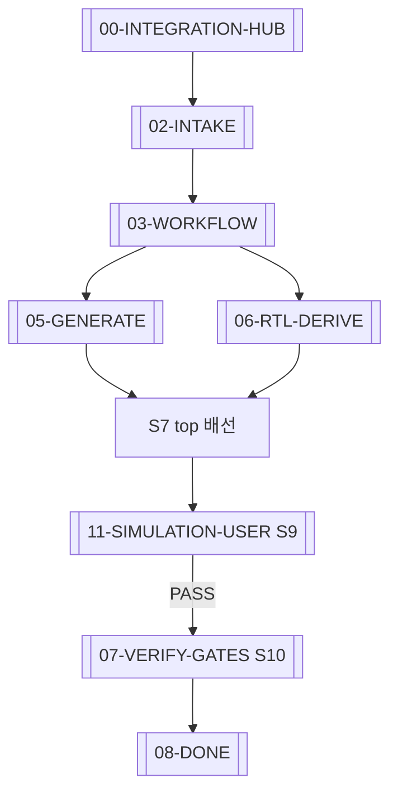

# VCPU → Customer SoC — Integration Agent Hub

태그: `#agent` `#integration` `#project/VERIF-CPU-SOC` `#vcpu`

> **독자:** VerifCPU VCPU를 **고객 실칩 SoC**에 이식하는 자율 LLM 에이전트.  
> `./example.sh` PASS ≠ chip 배선 완료 — 이 vault가 **통합 미션** SSOT.  
> **사람용 절차서:** `projects/VERIF-CPU-SOC/USER-PROCEDURE.md`

---

## S0 — RTL 경로 (선행, 필수)

```bash
cd projects/VERIF-CPU-SOC
./scripts/bootstrap_verifcpu_workspace.sh
```

- 로컬 SSOT: **`~/tools/__CFI/VerifCPU/verif_cpu_verilog`** (`discovered.yaml` `local_clone_path`)
- `cache.yaml` `clone.path` = `~/tools/__CFI` · `RTL_ROOT` = `clone.path` + `rtl_subdir`
- `RTL_ROOT` = `ops/intake_resolve.resolve_rtl_root()` 또는 intake `rtl.rtl_root_override`
- VerifCPU MD SSOT: `{RTL_ROOT}/howto_integrate.md`, `{RTL_ROOT}/vcpu_skill.md`
- 실패 시 S1 이후 **전부 중단**

---

## 에이전트 핵심 규칙 (고정)

1. **LLM이 통합(S0–S8)을 끝낸 뒤에만 시뮬(S9)** — S7 top 배선·S8 probe 완료 전 sim 실행 금지.
2. **S9 PASS 전 soc-verify gate(S10) 금지** — coi_conn·slave_rw는 smoke sim 이후.
3. **시뮬 환경·실행법은 사용자가 intake `simulation`에 적는다** — EDA/사내 flow 추측·자동 설치 금지.
4. intake 작성 시(S2) 펌웨어 경로(S2b)와 **함께** 시뮬 설정(S2d)도 사용자에게 받는다 — [[11-SIMULATION-USER]].

---

## Read order (고정)

| 순서 | 노트 | 한 줄 |
|------|------|-------|
| 1 | [[agent/vcpu-soc-integration/01-MISSION]] | 입력·출력·금지 사항 |
| 2 | [[agent/vcpu-soc-integration/02-INTAKE]] | 고객 SoC에서 **무엇을** 수집·파악할지 |
| 3 | [[agent/vcpu-soc-integration/03-WORKFLOW]] | 단계 그래프 + 각 step 링크 |
| 4 | [[agent/vcpu-soc-integration/04-MODES]] | wrapper vs injection 선택 |
| 5 | [[agent/vcpu-soc-integration/05-GENERATE]] | manifest·VH 생성 명령 |
| 6 | [[agent/vcpu-soc-integration/06-RTL-DERIVE]] | RTL에서 **무엇을** 뽑을지 |
| 7 | [[agent/vcpu-soc-integration/11-SIMULATION-USER]] | **통합 후 시뮬** (사용자 env·run) |
| 8 | [[agent/vcpu-soc-integration/07-VERIFY-GATES]] | gate — S9 PASS 후 |
| 9 | [[agent/vcpu-soc-integration/08-DONE]] | 성공 판정·보고 |
| 2b | [[agent/vcpu-soc-integration/09-FIRMWARE-USER]] | 사용자에게 C 경로 질문 |
| 2c | [[agent/vcpu-soc-integration/10-FIRMWARE-STAGE]] | C 다발 복사 → SCPU 수 맞춤 |
| 2d | [[agent/vcpu-soc-integration/11-SIMULATION-USER]] | 사용자에게 **시뮬 env·실행법** 질문 (intake `simulation`) |
| — | [[agent/vcpu-soc-integration/12-EXAMPLE-SCAFFOLD]] | **새 tag/칩 폴더** — gen이 안 만드는 MD·YAML 복사 |

**한 번에 읽지 말 것:** 각 step에서 링크된 SSOT만 열어 필요 필드만 채운다.

---

## SSOT 맵 (중복 작성 금지)

| 주제 | SSOT (링크만) | 에이전트가 여기서 파악할 것 |
|------|----------------|---------------------------|
| Manifest 행 계약 | VerifCPU `vcpu_skill.md` §2 | `cpu_id` / `tap_port` / `bus_port` 혼동 금지 |
| 신호·CONNECT 매크로 | VerifCPU `howto_integrate.md` | `CONNECT_SLVxx_*`, flat `g_slvN` |
| 사람용 절차 요약 | `projects/VERIF-CPU-SOC/howto_integrate2yourSoC.md` | gate 순서 |
| 예제 top 패턴 | VerifCPU `tb/chip_top_example.v` | orchestrator·pool·CONNECT 배치 |
| 생성 셀·바인딩 | VerifCPU `include/chip_top_example_gen.vh` | **수동 adapter 불필요** — `USE_MANIFEST_SOC_BUS` |
| bus_type 결정 | VerifCPU `amba_bus_registry.py` | canonical key ↔ RTL module |
| 검증 gate MD | [[projects/VERIF-CPU-SOC]] | c-compile → coi_conn → slave_rw |
| intake 템플릿 | `intake/customer_soc_intake.template.yaml` | 필드 스키마 |
| intake 예시 | `projects/VERIF-CPU-SOC/inputs/tags/main/deployment/customer_soc_intake.example.yaml` | `agent_runbook` · `gen_regeneration` |

---

## 그래프 (에이전트 루프)



---

## 상위 vault 연결

- 플랫폼: [[00-HUB]] · 검증 루프: [[03-COMPILED-AI-LOOP]] · 프로젝트: [[projects/VERIF-CPU-SOC]]
- Sub-agent gate 실행: [[SUB_AGENT]] (통합 **후** verify_group)

---

## 산출물 (에이전트가 쓸 파일)

| 산출 | 경로 패턴 |
|------|-----------|
| intake (채움) | `projects/VERIF-CPU-SOC/inputs/tags/{tag}/deployment/customer_soc_intake.yaml` |
| hierarchy SSOT | `{RTL_ROOT}/firmware/campaign/soc_hierarchy_{chip}.yaml` |
| connect VH | `{RTL_ROOT}/include/verif_soc_bus_connect.vh` (생성) |
| chip gen VH | `{RTL_ROOT}/include/chip_top_*_gen.vh` (생성) |
| 고객 top | 사용자 지정 — [[agent/vcpu-soc-integration/04-MODES]] |

`RTL_ROOT` = `~/tools/__CFI/VerifCPU/verif_cpu_verilog` (또는 `cache.yaml` `clone.path` + `rtl_subdir`).