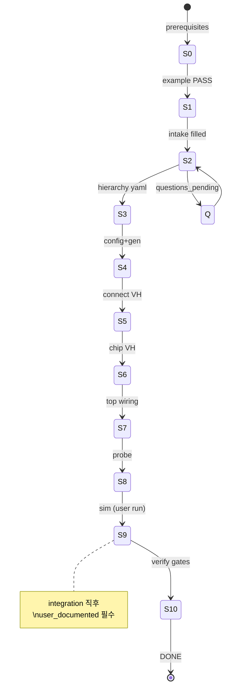

# Integration Agent — Workflow

태그: `#agent` `#integration`  
상위: [[agent/vcpu-soc-integration/00-INTEGRATION-HUB]]

---

## 단계 그래프

---

## Steps (링크 = SSOT)

| Step | 액션 (요약) | 상세 노트 / SSOT |
|------|-------------|------------------|
| **S0** | **VerifCPU 경로** · `RTL_ROOT` | `./scripts/bootstrap_verifcpu_workspace.sh` → `~/tools/__CFA` · `ops/intake_resolve.py` |
| **S1** | 예제 회귀 PASS (tier 3 scale) | VerifCPU `README.md` — `./example.sh gen`, `make full_campaign`, `make chip-top-example` |
| **S2** | intake 작성 | [[agent/vcpu-soc-integration/02-INTAKE]] — 펌웨어·**시뮬** 블록 포함 |
| **S2a** | **새 tag/칩이면 SSOT 복사** | [[agent/vcpu-soc-integration/12-EXAMPLE-SCAFFOLD]] — MD·intake·hierarchy **gen 전** |
| **S2b** | **사용자에게 펌웨어 C 경로 질문** | [[agent/vcpu-soc-integration/09-FIRMWARE-USER]] — `firmware.user_provided: true` |
| **S2c** | **C 다발 → campaign/ 복사 + slots** | [[agent/vcpu-soc-integration/10-FIRMWARE-STAGE]] — `firmware.staging.status: staged` |
| **S2d** | **사용자에게 시뮬 env·실행법 질문** | [[agent/vcpu-soc-integration/11-SIMULATION-USER]] — `simulation.user_documented: true` |
| **S3** | `soc_hierarchy_{chip}.yaml` | `soc_hierarchy_example.yaml` 복사·채움 |
| **S4** | manifest·fw·icode | [[agent/vcpu-soc-integration/05-GENERATE#s4]] — **S2c 완료 후만** |
| **S5** | `verif_soc_bus_connect.vh` | [[agent/vcpu-soc-integration/05-GENERATE#s5]] |
| **S6** | `chip_top_*_gen.vh`, bus bind VH | [[agent/vcpu-soc-integration/05-GENERATE#s6]] |
| **S7** | top 배선 | [[agent/vcpu-soc-integration/04-MODES]] · `chip_top_example.v` diff |
| **S8** | icode probe | VerifCPU `tools/probe_icodes.py` — `vcpu_skill.md` §7 Step 4 |
| **S9** | **통합 후 시뮬 (필수)** | [[agent/vcpu-soc-integration/11-SIMULATION-USER]] — intake `simulation.run` |
| **S10** | soc-verify gates | [[agent/vcpu-soc-integration/07-VERIFY-GATES]] — **S9 PASS 후만** |

---

## 의존성

| Step | 선행 |
|------|------|
| S2a | 새 `inputs/tags/{tag}/` 또는 새 `soc_hierarchy_<chip>.yaml` — **예제·`_scaffold`에서 복사** |
| S2b | S2 — **펌웨어 경로 사용자 응답** |
| S2c | S2b + bundle/`staging.source_bundle` — **복사·campaign_slots.yaml·NUM_SCPU** |
| S2d | S2 — **시뮬 setup·run 사용자 응답** (S7 전에 intake에 기록) |
| S3 | S2c 권장 선행 (주소·cpu_id 정합) |
| S4 | S3 + `questions_pending` 없음 + **`firmware.staging.status: staged`** |
| S5 | S4 `make config` |
| S6 | S4 `make icodes` + S3 hierarchy |
| S7 | S5 + S6 산출물 |
| S8 | S4 icodes |
| S9 | S7 + S8 + **`simulation.user_documented: true`** |
| S10 | **S9 `last_run.status: pass`** + S1 sanity (coi_conn/slave_rw top·filelist) |

---

## 실패 시

| Step | 읽을 것 |
|------|---------|
| S4–S6 | VerifCPU `README.md` troubleshooting · `howto_integrate2yourSoC.md` §6 |
| S7 | `howto_integrate.md` §5 · `vcpu_skill.md` §10 |
| S8 | manifest vs `icode_map.json` — `howto_integrate.md` §5.2 |
| S9 | 사용자 `simulation.run` · VerifCPU `README.md` troubleshooting |
| S10 | gate `RESPOND.md` — [[projects/VERIF-CPU-SOC]] |