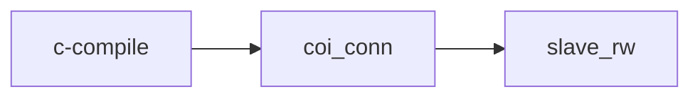

# Integration Agent — soc-verify-agent Gates

태그: `#agent` `#integration` `#project/VERIF-CPU-SOC`  
상위: [[agent/vcpu-soc-integration/00-INTEGRATION-HUB]]  
**선행:** [[agent/vcpu-soc-integration/11-SIMULATION-USER]] (S9 smoke PASS)  
프로젝트: [[projects/VERIF-CPU-SOC]] · Sub-agent: [[SUB_AGENT]]

---

## intake → gate crystallize (S10 전)

```bash
cd projects/VERIF-CPU-SOC
python3 scripts/crystallize_gate_from_intake.py
# → inputs/tags/{tag}/overrides/coi_conn_checks.json
# → inputs/tags/{tag}/overrides/slave_rw_scenarios.json
```

| override | intake에서 가져오는 것 |
|----------|------------------------|
| `coi_conn_checks.json` | `rtl.customer_top`, `filelist` → top·checks prefix |
| `slave_rw_scenarios.json` | `slaves[]`, `simulation.pass.log_markers`, `simulation.gate_tiers` |

`02_static_*` · `03_simulation_*` 스크립트가 `customer_soc_intake.yaml` 있으면 자동 호출합니다.

---

## S9 → S10 순서 (필수)

**통합(S7) 후 사용자 시뮬(S9)을 먼저** — intake `simulation.run.smoke_after_integration`.  
S9 PASS 없이 이 gate sequence 시작 **금지**.

| 단계 | 역할 |
|------|------|
| S9 | 사용자 정의 smoke — 배선·fw 빠른 확인 |
| S10 G3 slave_rw | formal 3-tier + verdict (ops) |

---

## 순서 (고정)



오케스트레이터: `projects/VERIF-CPU-SOC/scripts/run_VERIF-CPU-SOC_verification_sequence.sh`

---

## 통합 후 에이전트가 갱신할 것

| Gate | crystallize 대상 | 파악·갱신 |
|------|------------------|-----------|
| c-compile | 보통 유지 | `RTL_ROOT`만 맞으면 `./example.sh gen` |
| coi_conn | filelist, top, endpoints | [[06-RTL-DERIVE#5]] · `coi_conn.md` |
| slave_rw | TB top, tier log 마커 | `slave_rw.md` — 고객 top이면 ops 제안 |

**원칙:** MD(CHECK/spec)는 **판정 기준** 유지, ops는 환경에 맞게 crystallize — [[03-COMPILED-AI-LOOP]]

---

## G1 — c-compile {#c-compile}

| 항목 | SSOT |
|------|------|
| CHECK | `verification/sanity/c-compile/CHECK.md` |
| ops | `ops/sanity/c-compile.py` |
| script | `scripts/01_sanity_VerifCPU_c-compile_and_elab.sh` |

**PASS:** `verdict_c-compile.json` `status==PASS` · [[04-ARTIFACT-GRAPH#verdict]]

---

## G2 — coi_conn {#coi_conn}

| 항목 | SSOT |
|------|------|
| spec | `verification/static/coi_conn/coi_conn.md` |
| checks | `coi_conn_checks.json` (2~3건) |
| tool | `scan-inst` — `conn_example.json` 카탈로그 |

**에이전트:** 고객 top/instance로 endpoint **재작성** 후 script 실행.

```bash
./scripts/02_static_COI_connectivity_chip_top.sh
```

---

## G3 — slave_rw {#slave_rw}

| 항목 | SSOT |
|------|------|
| spec | `verification/simulation/slave_rw/slave_rw.md` |
| tiers | sim_single → sim_burst → sim_cpu_sync |
| fw | c-compile 산출 **재빌드 금지** |

```bash
./scripts/03_simulation_slave_R_W_single_burst_cpu_sync.sh
```

**고객 top:** tier별 `vvp` target/filelist를 ops에 crystallize — 마커는 spec 표 동일.

---

## graph 연동 (선택)

통합 검증을 graph로 돌릴 때:

```bash
soc-verify --root . graph start --project VERIF-CPU-SOC --stage static --group coi_conn
```

[[SUB_AGENT]] — `md_only_prompt.md` + RESPOND 준수.

---

## intake 등록

gate 입력 artifact:

```yaml
# inputs/tags/{tag}/manifest.yaml
artifacts:
  - path: deployment/customer_soc_intake.yaml
    kind: deployment
    used_by: [static/coi_conn, simulation/slave_rw]
```