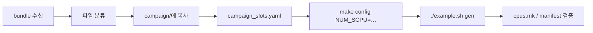

# Integration Agent — Stage User C Bundle → SCPU Count

태그: `#agent` `#integration` `#firmware-stage`  
상위: [[agent/vcpu-soc-integration/00-INTEGRATION-HUB]]  
선행: [[agent/vcpu-soc-integration/09-FIRMWARE-USER]] (`firmware.user_provided: true`)  
다음: [[agent/vcpu-soc-integration/05-GENERATE#s4]]

---

## Mission (이 단계에서 하는 일)

사용자가 준 **C/헤더 다발**을 VerifCPU `firmware/campaign/` **정해진 자리**에 복사·정렬하고,  
`campaign_slots.yaml` + `NUM_SCPU`를 맞춰 **`./example.sh gen` 후 active SCPU 수만큼** 빌드·VH가 나오게 한다.

**에이전트가 하는 것:** 복사·`campaign_slots.yaml` 갱신·`make config`·검증.  
**사용자가 하는 것:** 주소·검증 시나리오가 맞는 C 소스 **제공** (내용 작성).

---

## 게이트

| 조건 | 행동 |
|------|------|
| `firmware.user_provided != true` | [[09-FIRMWARE-USER]] 질문 먼저 |
| 사용자 bundle 경로 없음 | `firmware.staging.source_bundle` 요청 |
| 복사·slots 갱신 전 S4 | **금지** |
| `staging.status: staged` + gen OK | S4 진행 |

---

## 대상 트리 (SSOT)

루트: `{RTL_ROOT}/firmware/campaign/`  
레이아웃·편집 규칙: VerifCPU `example_outputs.md` §10.

```text
firmware/campaign/
├── campaign_slots.yaml      ← active[] = SCPU 슬롯 SSOT (에이전트 갱신)
├── include/
│   ├── soc_regs.h           ← 주소 상수
│   ├── soc_platform.h
│   └── soc_init_seq.h
├── common/
│   ├── phase_a.c
│   └── phase_b.c
├── cpu_{role}/              ← role: sfr | sram | uart | … (슬롯당 1 dir)
│   ├── phase_c.c            ← 또는 uart_fw.c → slots의 phase_c 경로와 일치
│   └── sync_barrier.c       ← role이 sfr/sram/uart면 필요 (gen_campaign_config SYNC_BARRIER_SRC)
├── icodes/{role}/
│   └── check_*.c            ← 파일명 = campaign_slots targets[].icode
└── cpu_generic/noop.c       ← reserved용 — 건드리지 않음
```

---

## 복사 매핑 (에이전트 분류 규칙)

사용자 파일명·intake `firmware.paths`·`staging.file_map`을 보고 **아래 중 하나**로 분류 후 복사.

| 사용자 파일 (패턴) | 복사 대상 (campaign 기준) | 비고 |
|--------------------|---------------------------|------|
| `soc_regs.h` | `include/soc_regs.h` | sym ↔ `targets[].sym` 일치 권장 |
| `soc_platform.h` | `include/soc_platform.h` | init_done |
| `soc_init_seq.h` | `include/soc_init_seq.h` | |
| `phase_a.c` | `common/phase_a.c` | 공통 |
| `phase_b.c` | `common/phase_b.c` | 공통 |
| `phase_c.c`, `*_fw.c` | `cpu_{role}/phase_c.c` | slots `phase_c:` 경로와 **동일 문자열**로 등록 |
| `sync_barrier.c` | `cpu_{role}/sync_barrier.c` | sfr/sram/uart role |
| `check_*.c` | `icodes/{role}/check_*.c` | basename = `targets[].icode` |
| `campaign_slots.yaml` | `campaign_slots.yaml` | 사용자 SSOT면 merge, 없으면 에이전트 작성 |

**분류 불가** → `questions_pending` — 임의 디렉터리에 넣지 않음.

### intake `staging.file_map` (명시적일 때 우선)

```yaml
staging:
  file_map:
    - src: /path/from/user/check_dma.c
      dest: icodes/dma/check_dma_ctrl.c
      role: dma
      slot_name: DMA_CH3
```

---

## `campaign_slots.yaml` — SCPU 수 맞추기

형식 SSOT: `{RTL_ROOT}/firmware/campaign/campaign_slots.yaml` (예제 파일 참조만, **내용은 intake에서 derive**).

### active 슬롯 1행 = SCPU 1개 (cpu_id 1..N)

intake `slaves[]` 중 `enabled: 1`마다 `active:` 에 추가:

```yaml
active:
  - name: SFR          # slots name → cpus.mk CPU_SFR
    cpu_id: 1          # SCPU 번호 (unique)
    tap_port: 0
    bus_type: apb3     # intake / soc_hierarchy 와 동일
    bus_port: S01_APB
    role: sfr
    phase_c: cpu_sfr/phase_c.c    # 복사한 phase C 경로
    targets:
      - { sym: SFR_CTRL, expect: 0x1, icode: check_sfr_ctrl }
```

| 필드 | 출처 |
|------|------|
| `cpu_id`, `tap_port`, `bus_*` | intake `slaves[]` |
| `phase_c` | 실제 복사 경로 |
| `targets[].icode` | `icodes/{role}/` 에 있는 `check_*.c` basename |
| `targets[].sym` | `soc_regs.h` 심볼 또는 intake `targets[].sym` |

### reserved / 총 SCPU 수

```bash
# max cpu_id = active + reserved (wired but noop)
make -C firmware/campaign config NUM_SCPU=<max_cpu_id>
```

- `NUM_SCPU` = intake `chip.num_scpu` (≥ max `cpu_id`)
- `campaign_slots.yaml`의 `max_slots` (기본 60) 이내
- 미사용 id는 gen이 **RESxx noop** 으로 채움 — `gen_campaign_config.py` `expand_slots_to_max`

**확인:** gen 후 `cpus.mk` 의 `CPU_ACTIVE` 개수 = enabled active 슬롯 수.

---

## 에이전트 절차 (S2c)



1. **백업** (선택): `firmware/campaign/.backup-{tag}/` — 예제 덮어쓰기 전
2. **복사** — 위 매핑표 · `staging.file_map`
3. **`campaign_slots.yaml`** — `active[]` = intake enabled slaves; `phase_c`·`targets`·`icode` 이름 정합
4. **`soc_regs.h` sym** — `targets[].sym` resolve 가능한지 (`gen_campaign_config.py` `SYM_ADDR` 또는 numeric)
5. **config + gen**

```bash
cd "$RTL_ROOT/firmware/campaign"
make config NUM_SCPU=<from intake chip.num_scpu>
cd "$RTL_ROOT"
./example.sh gen
python3 tools/probe_icodes.py
```

6. **검증** (FAIL 시 S4 금지)

| 확인 | 기대 |
|------|------|
| `cpus.mk` `CPU_ACTIVE` | `SFR SRAM UART …` = active `name` 목록 |
| `include/campaign_manifest.h` | `MANIFEST_SLAVES[]` 행 수 = `NUM_SCPU` |
| `build/*.bin` | active name마다 bin |
| `icode_map.json` | 각 `targets[].icode` 항목 존재 |
| `include/tb_full_campaign_gen.vh` | active VCPU/agent generate 블록 |

7. intake 갱신:

```yaml
firmware:
  staging:
    status: staged
    staged_at: <iso8601>
    num_active_scpu: <N>
    num_scpu_total: <NUM_SCPU>
```

---

## sync_barrier · uart 특수

| role | 추가 소스 | SSOT |
|------|-----------|------|
| sfr, sram, uart | `cpu_{role}/sync_barrier.c` | `gen_campaign_config.py` `SYNC_BARRIER_SRC` |
| uart | `phase_c`가 `cpu_uart/uart_fw.c` 일 수 있음 | 예제 `campaign_slots.yaml` UART 행 |

사용자 bundle에 없고 role이 sfr/sram/uart면 — 예제 `sync_barrier.c` **복사 후 주소만 사용자 soc_regs에 맞게 수정** 여부를 사용자에게 확인 (묵시 복사 금지 → 질문).

---

## 금지

- C 내용을 LLM이 **새로 작성**해 채우기 (복사·경로 정렬만)
- `campaign_slots.yaml` 없이 gen → SCPU 수 불일치
- icode 파일명과 `targets[].icode` 불일치
- `include/*.vh` 생성물을 손으로 편집

---

## 관련

- 질문·경로 수집: [[09-FIRMWARE-USER]]
- generate 파이프라인: [[05-GENERATE]]
- soc_hierarchy·CONNECT: S3 이후, SCPU 수와 **독립**이나 `cpu_id`는 **동일**해야 함