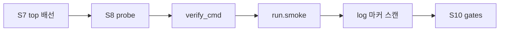

# Integration Agent — Simulation After Wiring (User Env)

태그: `#agent` `#integration` `#simulation` `#user-owned`  
상위: [[agent/vcpu-soc-integration/00-INTEGRATION-HUB]]  
선행: **S7 top 배선 완료** · [[agent/vcpu-soc-integration/04-MODES]]  
다음: [[agent/vcpu-soc-integration/07-VERIFY-GATES]] (S10 — formal gate)

---

## 원칙

1. **LLM이 통합(S0–S8)을 마친 뒤에만 시뮬(S9)** — 배선·probe 전 sim 금지.
2. **시뮬 설정은 intake `simulation` 블록** — 사용자가 env 구하는 방법·실행 명령을 **간단히** 적는다 (설정 SSOT).
3. 에이전트가 EDA/사내 flow·module·Docker를 **추측·설치하지 않음**.
4. S9 smoke PASS(또는 사용자 `log_markers`) 후에만 S10 soc-verify gate.

VerifCPU 기본(iverilog)은 **참고 SSOT**만 링크 — 사용자 `simulation.run`이 우선.

---

## 에이전트 필수 — 사용자에게 시뮬 설정 질문 (S2d)

**S7 이전**, intake 작성 시(S2) 펌웨어 질문(S2b)과 **같이** 아래를 받아 `simulation` 블록에 기록.  
미작성(`user_documented != true`) 시 **S9·S10 실행 금지**.

### 사용자가 intake에 적는 최소 항목

| 항목 | YAML 필드 | 예시 (한두 줄이면 충분) |
|------|-----------|-------------------------|
| 환경 구하는 방법 | `environment.setup` | `module load questa/2024` / `docker pull …` |
| 준비 확인 | `environment.verify_cmd` | `iverilog -V && which vvp` |
| 통합 직후 실행 | `run.smoke_after_integration` | `cd $RTL_ROOT && make chip-top-example` |
| PASS 판정 | `pass.log_markers[]` | `chip_top_example: PASS` |

### 질문 템플릿

```markdown
통합 후 시뮬레이션을 돌리려면 아래를 알려주세요.

1. **시뮬 환경 구하는 방법** — 모듈 load, Docker, apt, 사내 스크립트, 라이선스 서버 등
2. **환경 확인 명령** — 한 줄로 준비됐는지 검사 (예: `iverilog -V && which vvp`)
3. **통합 직후 smoke 실행법** — cwd, env var, make/vvp/사내 run 스크립트 전체
4. **PASS 로그 마커** — sim.log에서 볼 문자열 (예: `chip_top_example: PASS`, `43/43`)
5. (선택) 고객 top 전용 sim — wrapper가 아닌 injection일 때 별도 명령
6. (선택) 사전 빌드 — compile만 먼저, sim은 나중에 분리하는지

예제 VerifCPU iverilog만 쓰는 경우:
- setup: `apt install iverilog` + RISC-V gcc 경로
- run: `cd $RTL_ROOT && make chip-top-example`
```

응답 후 → `simulation.user_documented: true`

---

## intake `simulation` 필드 {#simulation-intake}

템플릿: `intake/customer_soc_intake.template.yaml` · 상세: [[agent/vcpu-soc-integration/02-INTAKE#simulation]]

| 필드 | 사용자가 적는 내용 |
|------|-------------------|
| `environment.setup` | 도구 설치·module·Docker·라이선스 |
| `environment.verify_cmd` | 준비 확인 1줄 |
| `run.smoke_after_integration` | **S9 필수** — 통합 직후 실행 명령(블록) |
| `run.customer_top` | injection / 별도 TB (없으면 smoke와 동일) |
| `pass.log_markers[]` | PASS 판정 문자열 |
| `use_verifcpu_default` | `true`면 README 예제 명령 허용 (사용자 명시 시만) |
| `run_smoke_in_s10_gate` | `false`(기본) — S9가 smoke 담당; `true`면 S10 slave_rw도 재실행 |

---

## S9 — 에이전트 실행 절차



1. `simulation.user_documented == true` 확인
2. 사용자 `environment.verify_cmd` 실행 — FAIL 시 **중단**, setup 안내
3. 사용자 `run.smoke_after_integration` 실행 (또는 `use_verifcpu_default` + [[08-DONE#sim-markers]] 참고)
4. log에서 `pass.log_markers` 스캔 — 없으면 FAIL, `RESPOND` 방향은 VerifCPU `README.md` troubleshooting
5. intake 갱신:

```yaml
simulation:
  last_run:
    at: <iso8601>
    command: "<실행한 명령>"
    log_path: "<runs/.../sim_smoke.log>"
    status: pass | fail
```

**S9 PASS 전 S10(slave_rw gate) 금지.**

---

## VerifCPU 기본 참고 (사용자가 default 쓸 때만)

| 항목 | SSOT |
|------|------|
| 도구 | VerifCPU `README.md` 사전 요구사항 — `iverilog`, `vvp`, RISC-V gcc |
| smoke | `make chip-top-example` (wrapper) · `make full_campaign` (campaign) |
| tier gate | `slave_rw.md` 3-tier — S10에서 formalize |

사용자 `run`과 충돌 시 **항상 사용자 run 우선**.

---

## S9 vs S10 slave_rw

| | S9 smoke | S10 slave_rw gate |
|--|----------|-----------------|
| 시점 | 통합 직후 | S9 PASS 후 |
| 명령 | intake `simulation.run` | `scripts/03_simulation_*.sh` / ops |
| 판정 | 사용자 `log_markers` | `slave_rw.md` tier 마커 + verdict JSON |
| 목적 | 배선·fw 동작 빠른 확인 | soc-verify 재현·보고 |

---

## 금지

- S7 후 gate(S10) 바로 실행
- iverilog/Questa 등 **추측** 설치
- sim PASS 없이 통합 완료 보고