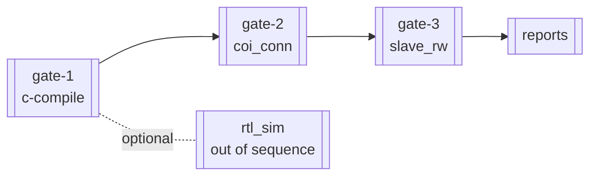

# Project — VERIF-CPU-SOC

태그: `#project/VERIF-CPU-SOC` `#milestone/M2`  
상위: [[00-HUB]] · 미션: [[MISSION_VERIF-CPU-SOC]] · **SoC 통합:** [[agent/vcpu-soc-integration/00-INTEGRATION-HUB]] · 루프: [[03-COMPILED-AI-LOOP]]

---

## Gate 그래프 (검증 순서 SSOT)



| Step | Gate | MD 명세 | ops | step script | report |
|------|------|---------|-----|-------------|--------|
| 1 | sanity / c-compile | `verification/sanity/c-compile/CHECK.md` | `ops/sanity/c-compile.py` | `01_sanity_VerifCPU_c-compile_and_elab.sh` | — |
| — | sanity / rtl_sim | `verification/sanity/rtl_sim/CHECK.md` | `ops/sanity/rtl_sim.py` | *(sequence 미포함)* | — |
| 2 | static / coi_conn | `verification/static/coi_conn/coi_conn.md` | `ops/static/coi_conn.py` | `02_static_COI_connectivity_chip_top.sh` | `static_coi_conn.md` |
| 3 | simulation / slave_rw | `verification/simulation/slave_rw/slave_rw.md` | `ops/simulation/slave_rw.py` | `03_simulation_slave_R_W_single_burst_cpu_sync.sh` | `simulation_slave_rw.md` |

**연결:** 각 gate PASS → [[node/finalize_reproduction]] → 해당 `NN_*.sh`

---

## gate-1 — sanity / c-compile

- **CHECK:** `projects/VERIF-CPU-SOC/verification/sanity/c-compile/CHECK.md`
- **depends_on:** —
- **verdict:** `runs/{id}/verdict_c-compile.json`
- **trust:** `trust/registry.yaml` → `c-compile.py` (draft, 0.0) ⚠️ [[05-GAPS-REMEDIATION#trust-bootstrap]]
- **입력:** `inputs/tags/main/manifest.yaml`

---

## gate-2 — static / coi_conn

- **spec:** `coi_conn.md` (CHECK는 요약)
- **depends_on:** sanity (문서) — preflight **미강제** [[05-GAPS-REMEDIATION#depends-on-gate]]
- **외부 도구:** hier-walk
- **verdict:** `verdict_coi_conn.json` → `connectivity` map

---

## gate-3 — simulation / slave_rw

- **spec:** `slave_rw.md` — 3-tier (sim_single, sim_burst, sim_cpu_sync)
- **depends_on:** sanity/c-compile (fw 불변 원칙)
- **공통 코어:** `ops/sanity/_verifcpu.py` [[04-ARTIFACT-GRAPH#verdict]]
- **참조 run:** `coi-conn-test`, `exit-scan-test2` → `reports/index.yaml`

---

## 재현 · 보고서

| SSOT | 경로 |
|------|------|
| 순서 | `scripts/verification_sequence.yaml` |
| 오케스트레이터 | `scripts/run_VERIF-CPU-SOC_verification_sequence.sh` |
| 규칙 | `scripts/README.md` |
| 보고서 | `reports/by_tag/main/SUMMARY.md` |

```bash
./scripts/run_VERIF-CPU-SOC_verification_sequence.sh
```

---

## 프로젝트 갭 (요약)

→ 전체: [[05-GAPS-REMEDIATION]]

- [ ] trust bootstrap (4 ops draft)
- [ ] rtl_sim sequence 포함 여부 결정
- [ ] `state.yaml` due ↔ 실제 PASS run 불일치
- [ ] golden fixtures 없음
- [ ] MD↔ops drift (`PREREQ_MARKERS` vs CHECK)

---

## SoC 통합 (VCPU → 실칩)

- 에이전트 vault: [[agent/vcpu-soc-integration/00-INTEGRATION-HUB]]
- 사람용 요약: `projects/VERIF-CPU-SOC/howto_integrate2yourSoC.md`
- VerifCPU SSOT: `vcpu_skill.md`, `howto_integrate.md` (RTL 패키지)

---

## 위키 링크

- [[MISSION_VERIF-CPU-SOC]]
- [[agent/vcpu-soc-integration/00-INTEGRATION-HUB]]
- [[01-GRAPH-FLOW#verify_group]]
- [[04-ARTIFACT-GRAPH]]
- [[06-INDUSTRY-PATTERNS#regression-runners]]